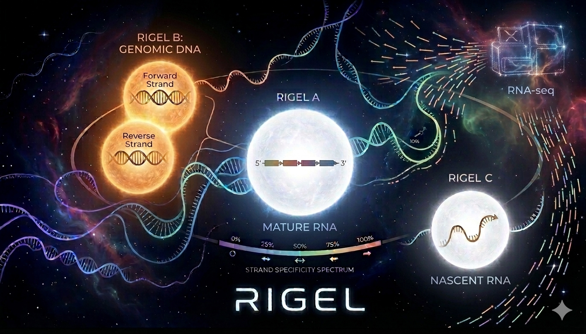

<p align="center">
  
</p>

<p align="center">
  <strong>Bayesian RNA-seq quantification with joint mRNA, nascent RNA, and genomic DNA modeling</strong>
</p>

<p align="center">
  <a href="https://github.com/mkiyer/rigel/actions"></a>
  <a href="https://pypi.org/project/rigel-rnaseq/"></a>
  <a href="https://anaconda.org/bioconda/rigel"></a>
  <a href="https://pypi.org/project/rigel-rnaseq/"></a>
  <a href="LICENSE"></a>
</p>

---

## Overview

<p align="center">
  
</p>

Rigel quantifies RNA-seq alignments while explicitly modeling three sources of
signal in the same library:

- Mature RNA (mRNA)
- Nascent RNA (nRNA)
- Genomic DNA contamination (gDNA)

The implementation is built around a single-pass native BAM scan plus a
locus-level EM solver. A key architectural change in the current codebase is
that nRNA is no longer represented as one shadow per transcript. Instead,
Rigel builds a global table of unique nRNA spans keyed by `(ref, strand,
start, end)` and shares each nRNA component across transcripts with the same
genomic span. This reduces redundant nRNA states in loci with many isoforms
that start and end at the same coordinates.

### Key features

- Joint mRNA, nRNA, and gDNA quantification in one locus-level model
- Shared-span nRNA architecture with one component per unique genomic span `(ref, strand, start, end)`
- Single-pass C++ BAM scanner using htslib, with memory-bounded buffering and spill-to-disk support
- Automatic strand-model training from annotated spliced fragments; protocol auto-detection (`R1-sense` / `R1-antisense`)
- Aggregate-first gDNA calibration using density, strand balance (Beta-Binomial), and fragment-length signals
- Empirical Bayes priors for nRNA fractions and gDNA rates; calibrated per-locus gDNA initialization
- MAP-EM and Variational Bayes EM (VBEM, default) solver modes with SQUAREM acceleration
- Discrete fragment assignment: `fractional`, `map`, or `sample` (default) post-EM assignment modes
- Parallel BAM scanning and parallel locus EM controlled through one `--threads` setting
- Feather and TSV outputs plus optional annotated BAM output with per-fragment assignment tags

---

## Installation

### Bioconda

```bash
conda install -c conda-forge -c bioconda rigel
```

### PyPI

```bash
pip install rigel-rnaseq
```

The PyPI package name is `rigel-rnaseq` because `rigel` is already taken on
PyPI. The import name and CLI stay `rigel`.

### From source

```bash
git clone https://github.com/mkiyer/rigel.git
cd rigel

mamba env create -f mamba_env.yaml
conda activate rigel

pip install --no-build-isolation -e .
```

### Requirements

- Python 3.12+
- C++17-capable compiler
- Runtime dependencies: `numpy`, `pandas`, `pyarrow`, `pysam`, `pyyaml`

On macOS, install Xcode Command Line Tools first:

```bash
xcode-select --install
```

---

## Quick start

### 1. Build an index

```bash
rigel index \
    --fasta genome.fa \
    --gtf annotation.gtf \
    -o index/
```

The FASTA must have a `.fai` index. If needed:

```bash
samtools faidx genome.fa
```

### 2. Quantify a BAM

```bash
rigel quant \
    --bam sample.bam \
    --index index/ \
    -o results/
```

Input BAM requirements:

- Name-sorted or collated
- `NH` tag present for multimapper handling
- Splice-junction strand tag available for best strand-model training (`XS` or `ts`, or let Rigel auto-detect)

### 3. Inspect outputs

```bash
head results/quant.tsv
head results/gene_quant.tsv
head results/nrna_quant.tsv
head results/loci.tsv
cat results/summary.json
```

---

## Output files

| File | Description |
|------|-------------|
| `quant.feather` / `quant.tsv` | Transcript-level abundance table with `mrna`, `nrna`, `rna_total`, `tpm`, and QC columns |
| `gene_quant.feather` / `gene_quant.tsv` | Gene-level aggregates derived from transcript estimates |
| `nrna_quant.feather` / `nrna_quant.tsv` | nRNA-span-level abundance estimates (one row per unique genomic nRNA span) |
| `loci.feather` / `loci.tsv` | Per-locus EM summary with `mrna`, `nrna`, `gdna`, and `gdna_init` |
| `summary.json` | Library protocol, strand specificity, fragment-length histograms, calibration results, alignment counts, and global quantification totals |
| `config.yaml` | Resolved run configuration (parameters, I/O paths). Rerun with `rigel quant --config config.yaml` |
| `annotated.bam` | Optional annotated BAM with `ZT`, `ZG`, `ZI`, `ZJ`, `ZP`, `ZW`, `ZC`, `ZH`, `ZN`, `ZS`, `ZL` tags |

The `nrna` values in transcript- and gene-level tables are derived from shared
nRNA-span counts that are pro-rated across transcripts sharing the same span.

---

## How it works

Rigel runs in two logical stages.

### Architecture

```
 FASTA + GTF ──▶ Index Build (index.py) ──▶ Feather index files
                                                    │
 BAM file ──────────────────────────────────────────┤
                                                    ▼
                              ┌──────────────────────────────────┐
                              │  Stage 1: BAM Scan & Training    │
                              │  C++: BamScanner → Resolver      │
                              │  Py:  buffer.py, strand_model.py │
                              └──────────────┬───────────────────┘
                                             │ FragmentBuffer + models
                                             ▼
                              ┌──────────────────────────────────┐
                              │  Stage 2: Score & Route          │
                              │  C++: fused_score_buffer         │
                              │  Py:  scan.py → ScoredFragments  │
                              └──────────────┬───────────────────┘
                                             │ CSR arrays
                                             ▼
                              ┌──────────────────────────────────┐
                              │  Stage 3: gDNA Calibration       │
                              │  Py:  calibration.py, locus.py   │
                              └──────────────┬───────────────────┘
                                             │ per-locus γ (gDNA fraction)
                                             ▼
                              ┌──────────────────────────────────┐
                              │  Stage 4: Locus-Level EM         │
                              │  C++: batch_locus_em (SQUAREM)   │
                              │  Py:  estimator.py dispatch      │
                              └──────────────┬───────────────────┘
                                             │ posterior counts
                                             ▼
                              ┌──────────────────────────────────┐
                              │  Stage 5: Output                 │
                              │  Py:  cli.py → Feather/TSV/JSON  │
                              └──────────────────────────────────┘
```

### BAM scan and model training

A native scanner reads the BAM once, resolves fragments against the indexed
annotation, classifies splice structure, trains strand and fragment-length
models, and writes resolved fragment data into a columnar buffer.

The main strand model is trained from annotated spliced fragments with
unambiguous gene assignment. Diagnostic exonic and intergenic strand models are
also retained for reporting, but gDNA itself is always scored with strand
probability `0.5`.

### gDNA calibration

Before per-locus EM, Rigel runs an aggregate-first calibration pass over
genomic regions. Each region is classified using three signals: fragment
density (Gaussian mixture), strand balance (Beta-Binomial with shared κ),
and fragment length (separate RNA and gDNA models). Any region with spliced
fragments is forced to zero gDNA probability. The resulting per-region
posteriors (γ) are fragment-count-weighted to the locus level and used to
initialize the gDNA component in the EM.

### Locus-level EM

Ambiguous fragments are routed into CSR form and grouped into connected
components of overlapping transcripts. For a locus with `T` transcripts and `N`
unique nRNA spans, Rigel solves a `T + N + 1` component problem:

- `T` mRNA components
- `N` shared nRNA components
- `1` merged gDNA component for the locus

The solver runs VBEM (default) or MAP-EM with SQUAREM acceleration. A
tripartite prior (coverage-weighted OVR for mRNA, sparsifying Dirichlet for
nRNA, calibrated γ for gDNA) is applied. Post-EM fragments are assigned using
the configured assignment mode (`sample` by default).

---

## Documentation

| Document | Description |
|----------|-------------|
| [docs/MANUAL.md](docs/MANUAL.md) | CLI reference, parameter defaults, configuration rules, and output schema |
| [docs/METHODS.md](docs/METHODS.md) | Algorithmic description of the implemented model and priors |
| [docs/PUBLISHING.md](docs/PUBLISHING.md) | Release workflow for PyPI and Bioconda |
| [docs/PARAMETERS.md](docs/PARAMETERS.md) | Complete parameter reference with defaults and config dataclass mapping |

---

## Citing Rigel

If you use Rigel in research, cite the repository for now:

> Iyer MK. Rigel: Bayesian RNA-seq quantification with joint mRNA, nascent RNA,
> and genomic DNA modeling. 2026. https://github.com/mkiyer/rigel

---

## License

Rigel is distributed under the [GNU General Public License v3.0](LICENSE).

---

## Development

```bash
pytest tests/ -v
pytest tests/ --cov=rigel --cov-report=term-missing
```

