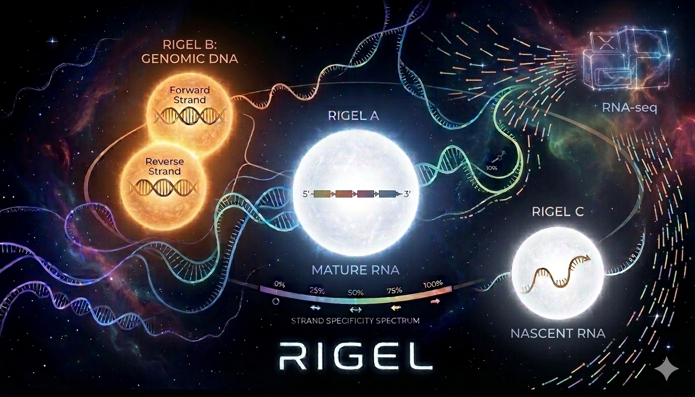

<p align="center">
  
</p>

<p align="center">
  <strong>Bayesian RNA-seq quantification with joint mRNA, nascent RNA, and genomic DNA modeling</strong>
</p>

<p align="center">
  <a href="https://github.com/mkiyer/rigel/actions"></a>
  <a href="https://pypi.org/project/rigel-rnaseq/"></a>
  <a href="https://anaconda.org/bioconda/rigel"></a>
  <a href="https://pypi.org/project/rigel-rnaseq/"></a>
  <a href="LICENSE"></a>
</p>

---

## Overview

<p align="center">
  
</p>

Rigel quantifies RNA-seq alignments while explicitly modeling three sources of
signal in the same library:

- Mature RNA (mRNA)
- Nascent RNA (nRNA)
- Genomic DNA contamination (gDNA)

The implementation is built around a single-pass native BAM scan plus a
locus-level EM solver. A key architectural change in the current codebase is
that nRNA is no longer represented as one shadow per transcript. Instead,
Rigel builds a global table of unique nRNA spans keyed by `(ref, strand,
start, end)` and shares each nRNA component across transcripts with the same
genomic span. This reduces redundant nRNA states in loci with many isoforms
that start and end at the same coordinates.

### Key features

- Joint mRNA, nRNA, and gDNA quantification in one locus-level model
- Shared-span nRNA architecture with one component per unique genomic span `(ref, strand, start, end)`
- Single-pass C++ BAM scanner using htslib, with memory-bounded buffering and spill-to-disk support
- Automatic strand-model training from annotated spliced fragments; protocol auto-detection (`R1-sense` / `R1-antisense`)
- gDNA/RNA calibration via a bipartite region↔boundary belief-propagation sweep that deconvolves each genomic node's unspliced mass into the `(RNA₊, RNA₋, gDNA)` simplex, library-agnostic
- Empirical Bayes priors for nRNA fractions and gDNA rates; calibrated per-locus gDNA initialization
- MAP-EM and Variational Bayes EM (VBEM, default) solver modes with SQUAREM acceleration
- Discrete fragment assignment: `fractional`, `map`, or `sample` (default) post-EM assignment modes
- Parallel BAM scanning and parallel locus EM controlled through one `--threads` setting
- Feather and TSV outputs plus optional annotated BAM output with per-fragment assignment tags

---

## Installation

### Bioconda

```bash
conda install -c conda-forge -c bioconda rigel
```

### PyPI

```bash
pip install rigel-rnaseq
```

The PyPI package name is `rigel-rnaseq` because `rigel` is already taken on
PyPI. The import name and CLI stay `rigel`.

### From source

```bash
git clone https://github.com/mkiyer/rigel.git
cd rigel

mamba env create -f mamba_env.yaml
conda activate rigel

pip install --no-build-isolation -e .
```

### Requirements

- Python 3.12+
- C++17-capable compiler
- Runtime dependencies: `numpy`, `pandas`, `pyarrow`, `pysam`, `pyyaml`

On macOS, install Xcode Command Line Tools first:

```bash
xcode-select --install
```

---

## Quick start

### 1. Build an index

```bash
rigel index \
    --fasta genome.fa \
    --gtf annotation.gtf \
    -o index/
```

The FASTA must have a `.fai` index. If needed:

```bash
samtools faidx genome.fa
```

### 2. Quantify a BAM

```bash
rigel quant \
    --bam sample.bam \
    --index index/ \
    -o results/
```

Input BAM requirements:

- Name-sorted or collated
- `NH` tag present for multimapper handling
- Splice-junction strand tag available for best strand-model training (`XS` or `ts`, or let Rigel auto-detect)

### 3. Inspect outputs

```bash
head results/quant.tsv
head results/gene_quant.tsv
head results/nrna_quant.tsv
head results/loci.tsv
cat results/summary.json
```

---

## Output files

| File | Description |
|------|-------------|
| `quant.feather` / `quant.tsv` | Transcript-level abundance table (annotated mRNA + nRNA rows) with `count`, `count_unambig`, `count_em`, `count_spliced`, `tpm`, `tpm_total_rna`, effective lengths, and per-transcript QC columns |
| `gene_quant.feather` / `gene_quant.tsv` | Gene-level aggregates derived from transcript estimates |
| `nrna_quant.feather` / `nrna_quant.tsv` | nRNA-span-level abundance estimates (one row per unique genomic nRNA span) |
| `loci.feather` / `loci.tsv` | Per-locus EM summary |
| `summary.json` | Library protocol, strand specificity, fragment-length histograms, the calibration scalars (`gdna_density_global`, `rna_sense_frac`, the gDNA/RNA strand overdispersions, `n_regions`), alignment counts, and global quantification totals |
| `config.yaml` | Resolved run configuration (parameters, I/O paths). Rerun with `rigel quant --config config.yaml` |
| `locus_stats.feather` | Optional per-locus statistics, emitted only with `--emit-locus-stats` |
| `annotated.bam` | Optional annotated BAM with per-fragment assignment tags, written with `--annotated-bam` (a second BAM pass). Rigel guarantees a collated-in → collated-out contract: the output contains exactly the same records as the input (no drops, no duplications). |

`tpm` is normalized over annotated transcripts only; `tpm_total_rna` uses the
same numerator but normalizes over all RNA (annotated + synthetic nRNA spans),
so it is directly comparable to the `nrna_quant` TPM column.

The `nrna` values in transcript- and gene-level tables are derived from shared
nRNA-span counts that are pro-rated across transcripts sharing the same span.

---

## How it works

Rigel runs one native BAM pass feeding three stages: **scan**, **calibrate**,
and **quantify**.

### Architecture

```
 FASTA + GTF ──▶ Index Build (index.py) ──▶ Feather index files
                                                    │
 BAM file ──────────────────────────────────────────┤
                                                    ▼
                              ┌──────────────────────────────────┐
                              │  Stage 1: BAM Scan & Training    │
                              │  C++: BamScanner → Resolver      │
                              │  Py:  buffer.py, strand_model.py │
                              │  → FragmentBuffer + models +     │
                              │    accumulator (AccumulatorPayload)│
                              └──────────────┬───────────────────┘
                                             │ per-region/boundary mass
                                             ▼
                              ┌──────────────────────────────────┐
                              │  Stage 2: gDNA/RNA Calibration   │
                              │  Bipartite region↔boundary       │
                              │  belief-propagation sweep        │
                              │  Py:  node_chain → bp_solver     │
                              └──────────────┬───────────────────┘
                                             │ per-locus Dirichlet prior
                                             ▼
                              ┌──────────────────────────────────┐
                              │  Stage 3: Quantification         │
                              │  score → route → build loci →    │
                              │  per-locus EM                    │
                              │  C++: scoring, batch_locus_em    │
                              │  Py:  scan.py, locus.py,         │
                              │       estimator.py               │
                              └──────────────┬───────────────────┘
                                             │ posterior counts
                                             ▼
                              ┌──────────────────────────────────┐
                              │  Output: Feather / TSV / JSON    │
                              │  Py:  cli.py                     │
                              └──────────────────────────────────┘
```

### BAM scan and model training

A native scanner reads the BAM once, resolves fragments against the indexed
annotation, classifies splice structure, trains strand and fragment-length
models, and writes resolved fragment data into a columnar buffer. In the same
pass it deposits fractional per-region and per-boundary fragment mass into a
C++ accumulator (four channels: unspliced ±, spliced sense/antisense),
producing the `AccumulatorPayload` that calibration consumes.

The main strand model is trained from annotated spliced fragments with
unambiguous gene assignment. Diagnostic exonic and intergenic strand models are
also retained for reporting, but gDNA itself is always scored with strand
probability `0.5`.

### gDNA/RNA calibration

Before per-locus EM, Rigel deconvolves each genomic **node**'s unspliced
fragment mass into the 2-simplex `(f_rna₊, f_rna₋, f_g)` — sense-RNA /
antisense-RNA / gDNA. Calibration models *only* RNA-vs-gDNA; nascent-vs-mature
is separated downstream by the per-locus EM.

The deconvolution is a **belief-propagation sweep** over a bipartite
region↔boundary node chain. `node_chain` builds the chain from the accumulator
payload; `bp_solver.node_sweep` runs a single forward-backward pass (exact on
the chain, which is a forest of linear paths). Following the
**count-zero-information** principle, a fragment count carries no intrinsic
gDNA/RNA signal — a node's composition is set by exactly three sources:

1. a **strand likelihood** — the Beta-Binomial tilt of the per-strand counts
   (the only intrinsic gDNA/RNA signal; the count enters only as overdispersed
   Fisher information);
2. **cross-node imputation** — neighbour density messages at a belief-free
   Poisson disagreement variance, fit once; gDNA flows genomically, while
   per-strand RNA flows only where that strand is continuous across an edge
   (the transcript-structure gate);
3. the **global gDNA prior** — the population baseline plus a trained Phase-2
   gDNA-density KDE.

Calibration fits the library hyperparameters (`gdna_density_global`,
`rna_sense_frac`, and the gDNA/RNA strand Beta-Binomial overdispersions) plus
the per-region and per-boundary deconvolved gDNA/RNA mass. These are bridged
into **two per-locus Dirichlet scalars** (`gdna_prior_count`,
`rna_prior_count`) that set the gDNA-vs-RNA split feeding the EM. See
[docs/calibration/CALIBRATION_ARCHITECTURE.md](docs/calibration/CALIBRATION_ARCHITECTURE.md)
for the full theory.

### Locus-level EM

Ambiguous fragments are scored, routed into CSR form, and grouped into
connected components of overlapping transcripts. Each locus is an independent
subproblem with `n_t + 1` components — one per transcript **row** (annotated
mRNA and synthetic nRNA spans alike, since unique nRNA spans are materialized
as ordinary transcript rows) plus one merged gDNA component.

The solver runs VBEM (default; digamma soft updates) or MAP-EM with SQUAREM
acceleration, parallelized across loci with OpenMP. The calibration prior
enters as the two per-locus Dirichlet scalars; the EM distributes RNA mass
among the compatible transcripts. Post-EM fragments are assigned using the
configured assignment mode (`sample` by default).

---

## Documentation

| Document | Description |
|----------|-------------|
| [docs/MANUAL.md](docs/MANUAL.md) | CLI reference, parameter defaults, configuration rules, and output schema |
| [docs/METHODS.md](docs/METHODS.md) | Algorithmic description of the implemented model and priors |
| [docs/PUBLISHING.md](docs/PUBLISHING.md) | Release workflow for PyPI and Bioconda |
| [docs/parameters.md](docs/parameters.md) | Complete parameter reference with defaults and config dataclass mapping |

---

## Citing Rigel

If you use Rigel in research, cite the repository for now:

> Iyer MK. Rigel: Bayesian RNA-seq quantification with joint mRNA, nascent RNA,
> and genomic DNA modeling. 2026. https://github.com/mkiyer/rigel

---

## License

Rigel is distributed under the [GNU General Public License v3.0](LICENSE).

---

## Development

```bash
pytest tests/ -v
pytest tests/ --cov=rigel --cov-report=term-missing
```

