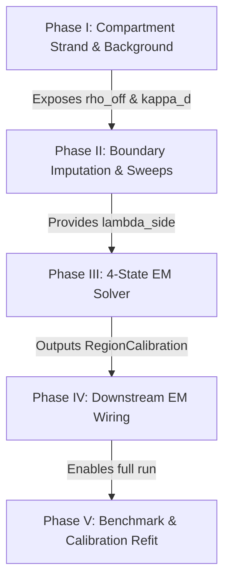

# TODO

## PR3 Issues 

## Revisions and Corrections. Section I.3 discusses which regions/sides contribute. We only use ANNOTATED splice junctions to train a strand model to minimize the chance of artifacts. There is an interesting point to make about AMBIG regions and spliced fragments. Spliced fragments have a DEFINED strand even when they overlap strand-ambiguous regions. In fact spliced fragments get a strand assigned even in an unstranded RNA-seq library. This is because the DNA splicing motifs (GT/AG, etc) are asymmetric and can be used to infer strand. So for spliced fragments, we have the strand from the assigned DNA splicing motif (the XS tag in the BAM file, or 'ts' tag for minimap2) as an orthogonal, independent strand definition. Spliced fragments can be resolved to a definite strand regardless of the overlapping region signatures. The overlapping regions could be ambiguous, but the spliced fragments can still be resolved. This is an important observation and it changes the way that we should accumulate fragments. Spliced fragments can likely be accumulated accurately to a correct genomic strand even across strand-ambiguous regions and boundaries. Annotated Spliced fragments can therefore be used to train the RNA strand model. This fact may require changing the design and the existing code. For strand-ambiguous regions and boundaries, we can still accumulate the spliced fragments (using the strand assigned by XS or ts BAM tags). We can still train RNA strand model from the spliced fragments. To be clear, we CANNOT resolve unspliced fragments within strand-ambiguous regions (strand-ambiguous is defined by the 4-bit signatures that contain some both + and - strand flags, exon+/intron-, exon-/intron+, exon+/exon-, intron+,intron-). ---- Now for the open decisions ---- ## III.1) 'kappa_rna' source: I did not realize that 'kappa_rna' was the mean of the beta binomial distribution. The RNA sense mean should come from the StrandModel. The StrandModel accumulates the strand from all annotated spliced fragments and is a global mean. This is highly accurate and what we should use. ## III.2) Agree that we can fit the RNA strand overdispersion from spliced counts using boundaries as our source of independent splice junction observations. It may be the case that we can safely model the RNA strand balance as a binomial distribution, but that is not certain until we examine a lot of real datasets. ---- ## III.3) I am not happy with the variable names and terminology. They are confusing. What is 'k_plus_spliced'? I don't recognize that variable name and search it not finding it. Yes, it seems that should be storing 'n_sense' and 'n_antisense' fragments (or n_sense and n_total). I am not sure what 'k_plus_spliced' is. First of all, throughout the code our convention is to use 'pos' and 'neg' for strand (NOT 'plus' and 'minus').   ## III.4) After careful thought, it appears that boundary integer flux can be shared for unspliced fragments, but cannot be shared for spliced fragments. This is a deviation from the current implementation that I have realized after careful thought. Spliced fragments can "jump" across one or more regions. The overlapping regions are not guaranteed to be contiguous. So for spliced reads, we need to partition integer flux per side, so that we don't accumulate both sides of an exon-intron boundary. This would introduce false flux for exon-intron boundaries, when the fragment actually skips the intron and goes to the next exon. This means the integer flux need left and right flux for spliced fragments. Unspliced fragments are guaranteed to be contiguous, and so unspliced fragment flux can continue to be shared. ## III.5) Fit method -- I am not sure which estimator to use. We may need to do some research/simulation with data and determine the best fit method. I'm not sure how to do it otherwise. ## III.6) the only magic number i want to discuss further is the "min observations to fit" number. I agree that a total spliced 'n' is helpful, but we also need to observe different regions to get a sense of variation in strand balance. ## III.8) Agree wire into calibrate() ## III.9) the scanner does not emit transcript-relative strand. the scanner / accumulator emits genome strand. It needs to be combined with the library prep observations and oriented correctly onto the transcript strand. 

## PR2 Issues

Key observation from reviewing PR02 -- We may have a bug related to strand orientation. When strand is NONE (intergenic) we can safely assign an arbitrary convention (sense = strand+ or pos strand). When strand is AMBIG (meaning overlapping transcripts on opposite strands) we CANNOT safely assign an arbitrary convention. By definition both strands are SENSE AND ANTISENSE because there are transcripts on both strands. We cannot employ strand deconvolution on regions with ambiguous strand (overlapping transcripts in opposite directions). For strand-ambiguous regions, we must deconvolute using other information -- We developed the "boundary/sweep" procedure to deconvolve ambiguous exons using adjacent boundaries. The imputation procedure is a "sweep" from left-to-right starting from a known/valid region/boundary and proceeding into ambiguous territory. Sweep can be left-to-right and right-to-left. This is how we can deconvolve ambiguous regions with density information. We can also fall back to global model parameters (global gDNA density) in regions that we cannot impute. This is present in the prior "burn" version of the repo and something you could partially resurrect and adapt.

## PR2 Decisions

### 1) phi_floor

I am not sure how to set this! This is a numerical floor, so you'll need to explore the numerical stability landscape and determine the proper floor

### 2) max_outer_iterations

I am not sure how to set this! Hopefully, this will converge in a few iterations. We will have to study this after the implementation is complete

### 3) boundary_split_factor

Agree, remove!

### 4) placeholder = no gDNA

If there is zero gDNA mass everywhere, then we the only sensible exposure factor is 1.0. There is no data to train with and 'uniform' is the only reasonable choice.

### 5) CalibrationResult.__post_init__

This seems okay. This is an implementation detail, not really a theory or algorithm design. I entrust you to produce a clear, concise, elegant implementation!

## PR1 Decisions

### Q1 — Region partition granularity (the big one)

A genome and a transcript annotation file (GTF) are required to define a region partitioning.

From the genome and GTF, we can define regions.

The definition of Regions requires a 4-bit signature:
- exon_pos (exonic, positive strand)
- exon_neg (exonic, negative strand)
- intron_pos (intronic, positive strand)
- intron_neg (intronic, negative strand)

Every position in the genome can be assigned a 4-bit signature. A region is a non-overlapping genomic interval where every position has the exact same signature.

Region definition:
1) A non-overlapping genomic interval
2) 'signature' (4-bit) is constant over all bases in the interval
3) A region and its neighbors MUST have different signatures!

In otherwords, adjacent regions with identical signatures MUST be merged!

Therefore, I agree with your recommendation that adjacent regions with identical signatures must be merged.

### Q2 - Intergenic handling

Intergenic regions should be included in BOTH the *density* and *strand* models. They are important sources of data for both models.

How do we use intergenic regions that lack a strand class? (strand is NONE).

For intergenic regions, we arbitrarily (randomly) assign 'sense' and 'antisense' strands. This is fair and works. One caveat: intergenic regions may contain unannotated transcripts. An unannotated transcript has no reference annotation and the strand is unknown. 

We do want to consider ways that we can avoid training our strand model in intergenic regions with a clear strand imbalance, but this is largely unavoidable. Outliers are expected to a certain extent and are part of the issue of overdispersion. Unannotated transcription can lurk everywhere and is a source of overdispersion in both annotated regions (due to antisense transcripts that is not annotated) and unannotated regions alike. We just have to acknowledge this and make our tool robust enough to not 'break'. This was the motivation for clipping the top X% of outlier density and potentially the top X% of clearly imbalanced strand in the first pass where we SEED the calibration EM. That way calibration doesn't start with a misconception of 'expressed' versus 'unexpresed'. Our new system must have robustness mechanisms in place to handle this as well.

### Question Q3 - Index schema bnump

Yes we can change the region schema and force rebuild with no consequences. No need for any backwards compatibility anywhere!

### Q4 -- yes, that is okay
### Q5 -- agree
### Q6 -- 

I want the code clean, concise, and organized. It shouldn't blow up into >25 modules with >90 magic number heuristics. This is essential.

If you are introducing a new magic number or heuristic or parameter, you MUST pause, clarify, and discuss. You can't forge on alone and produce a massive spaghetti code fest, or we will be right back where we started, burning everything to the ground and rebuilding again. Please be meticulous this time.

## PR0 Decisions

### Decision D1) 

ou need to give me a much more clear summary of this decision. Show how the plan uses boundary count signal. Define 'half-split' (this is obscure I have no idea what this means). Here is my understanding. We intentional keep boundaries separate from regions because boundaries are critical to measuring hybrid capture enrichment (exon-intron boundaries in particular). Boundary mass is split between "left" and "right". The "left" mass corresponds to the region to the left (if boundary is at index 'b', left region is 'b-1'). The "right" mass corresponds to the region to the right (if boundary is at index 'b', region to the right is at index 'b'). The left and right boundary masses are disjoint and partitioned for a reason. They are treated as asymmetric observations. They are deconvolved separately. The left and right boundary mass SHARES a common integer 'flux', or total fragments. This is critical as the number of integer fragments is important for bayesian shrinkage and statistical power. The fractional mass is important for density calculations. We need both. Please specify exactly what decisions we need to make here. ----- 

### Decision D2) what is 'kappa_rna'? 

#### Strand balance model

I assume this is the beta-binomial overdispersion parameter for the strand balance model? Here is how we estimate this -- we gather observations from Regions AND from Boundaries (both are informative). For every Region with >0 contained spliced fragments, we convert the raw observations into 'sense' and 'antisense' observations relative to the region strand (regions with ambiguous strand are excluded) and relative to the rna-seq library mode. Extract for each region the value for  `n_spliced_sense` sense counts and `n_spliced_antisense` antisense counts. This is the discrete strand balance data for a single Region. Now for Boundaries. You'll need to iterate over Boundary objects that are not strand-ambiguous. Remember a boundary has two sides (left and right). The left side corresponds to the left adjacent region. The right side corresponds to the right adjacent region. If the left region is ambiguous, the left side of the boundary is ambiguous (ambiguous means +/- strand transcripts overlap). If the right region is ambiguous (+/- strands overlapping), we cannot use the right boundary mass. Each boundary stores raw spliced counts on each strand. For each side of the valid boundary (left and right), extract `n_spliced_antisense` and `n_spliced_sense` counts for the boundary. This is your RNA strand balance data from the boundary. 

------- 

Hope that makes sense and you understand how to extract observations from REgions and Boundaries and can build the strand balance model that way. 

---------

We need to build a strand balance model with discrete integer counts, not fractions, so that the statistical power of the measurement and uncertainty can be modeled.

If we have 10 fragments with 9 sense and 1 antisense, our strand balance is 0.9.

If we have 100 fragments with 90 sense and 10 antisense, our strand balance is 0.9. 

Having 100 observations is much more reliable than 10 observations.

Our model needs to be trained accordingly with integer sense / antisense observations across regions and boundaries to be able to infer expected sense/antisense counts with defined uncertainty, so that we can model and develop a proper likelihood function.

We cannot train this with fractional strand balance (e.g. 0.50, 0.56) because 0.56 could be derived from a tiny or a huge number of fragments. I hope that makes sense. 

-----------

### Decision D3) per-transcript to per-locus prior bridge

This code may have been deleted as part of our 'burn'. However, the code should be largely usable! I recommend that you grab it from github and use it if possible. I can explain the concept. 

Calibration provides:
- Regional/Boundary deconvolution into gDNA + RNA components
- Regional/Boundary exposure factors

Region of length `L` base pairs (bp) has effective length dependent on the fragment length distribution `FL`:
- `region_eff_len` = `L - FL + 1`

A boundary is a single 'point'. The effective length of a boundary is equal to the fragment length distribution.

Boundary effective length can be interpreted differently for spliced/unspliced fragments:
- spliced fragments using the RNA FL distribution, with effective length of the RNA FL distribution
- unspliced fragments are a mixture of gDNA and RNA fragments, the gDNA fraction with gDNA FL and the RNA fraction with RNA FL

Each Region should have an exposure factor
Each Boundary should have an exposure factor

Region effective length is multiplied by region exposure factor
Boundary effective length multiplied by boundary exposure factor.

For a Locus, doing this for gDNA is easy. We just sweep across the regions from left to write, computing the effective length multiplied by the exposure factor for each region and each boundary.

A Locus has transcripts and we also need to compute exposure-weighted lengths for the transcripts.

- We need to collect the regions and boundaries that overlap the transcript
- We then sweep over the regions and a subset of the boundaries that are compatible with the transcript exons. For each compatible region and boundary we compute the exposure factor multiplied by the effective length and sum these. 
- Each transcript has its own exposure weighted effective length 

-----------------

### Decision D4) 

We have already pushed snapshots of the pre-burn github repo and these are already stored in our repo. You can peruse and grab useful bits of code from the github repo at any time. We burned everything down but there are still LOTS of useful code pieces in the repo.

The fragment length distribution code lives in archived source and could be recovered from there if needed.

I encourage you to explore the archived or deleted code as you implement and harness helpful pieces wherever you can. No need to reinvent the wheel and introduce new bugs. Always good to have a sense of the previous implementation as well to guide you, and you can likely improve upon it!

### Decision 5) Agree

### Decision 6) Yes Phase 0 is its own PR.

## Native fractional accumulator rework

I think we need to enhance our native fractional accumulator prior to tackling this new calibration system. The goal is to make the accumulator more efficient by separating 'regions' into 'regions' and 'boundaries'. Currently, a Region has a 1) left boundary, 2) a right boundary, and 3) contained fragments. Under the new model, 'regions' would store the 'contained' fragment data, and 'boundaries' would store boundary data. If we partition a reference chromosome into N regions numbered {0..N}, a Region at index 'i' would have Boundary structures at index 'i' (left boundary) and index 'i+1' (right boundary). Region structs would store part of the data, and Boundary structs would store boundary data. This would be a rewrite of the fractional accumulator and the calibration model would inherit this new structure. Currently, the calibration system constructs separate Region and Boundary objects from the fractional accumulator data. This is redundant work. The native accumulator should build these structures during the initial pass. It should be straightforward, because a reference chromosome can be broken up into non-overlapping regions, and each region has two boundaries. The number of boundaries equals the number of regions + 1. The leftmost boundary of a chromosome is empty/null and the rightmost boundary of a reference chrom is also empty/null. All other boundaries are shared by two regions. ----- What is stored in the 'Boundary' structures? Each boundary still needs to track two masses from left and right. Fractional Mass is broken down into: spliced_pos, spliced_neg, unspliced_pos, unspliced_neg (4 float32 per side x 2 (left and right) = 8 float32). Boundaries also store the total flux in discrete fragments (uint32) *once* per boundary. The total integer fragment flux (uint32) is broken down into spliced_pos, spliced_neg, unspliced_pos, unspliced_neg (uint32 x 4). So boundaries store BOTH fractional (float32) mass broken down into left/right, AND integer count 'flux' (not broken down by left/right). ----- What is stored in the 'Region' structures? Regions need to store contained counts. Contained counts are not fractional by definition, because the entire fragment is contained in the region. Only fragments that span multiple regions are divided into fractional counts and will appear as boundary mass, not contained mass. So regions can store (spliced_pos, spliced_neg, unspliced_pos, unspliced_neg) as float32 x 4 or as uint32 x 4. ------ Potential bug or inconsistency: What about fragments with many aligned blocks? We sequence paired-end fragments and this can manifest as multiple aligned blocks per fragment. WE need to audit the fractional accumulator. Are we accumulating "per block" or "per fragment"? This is challenging. For fragments longer then 2 x read_length, there is intervening portion in the middle of the fragment that is not sequenced, but is still implicit. This can result in implicit splice junctions (two aligned blocks of fragment are on different exons, but the splice junction is not explicitly sequenced and identified). Our fractional accumulator needs to operate at a "per-fragment" level to be fair. Fragments may be made of multiple aligned blocks. IF we accumulate "aligned blocks", we need to ensure that we normalize correctly. We might have 3 aligned blocks with lengths 50, 100, 150, with total sequenced length 300bp, but the fragment length may have been 500bp. The fair solution is to normalize by the fragment length (each base gets 1/500 share) but this requires knowing fragment length (we often don't know this). So the next best thing to do is normalize by sum of sizes of the aligned blocks. So we would normalize 1/300 in the example. So that changes the Region struct. Regions may to store both fractional and integer values: (spliced_pos, spliced_neg, unspliced_pos, unspliced_neg) as float32 and ALSO as uint32. The integer fragment counts are incremented ---- What about fragments with multiple aligned blocks but no spliced? Should this be accumulated as boundary flux? Which boundaries? We can only accumulate boundaries that are observed/implied by the aligned blocks we can see. If a fragment aligns to multiple "regions", it is by definition not contained, and so the best we can do is accumulate it at the boundaries. Here's the example. Transcript with exons (1000,2000), (5000,6000), (9000,15000). Fragment with two aligned blocks at (1800, 1950) and (5050,5200) -- 300bp of aligned blocks involving two different exons (and hence two regions). Is this a 'contained' fragment? NO! It is actually an example of boundary crossing fragment because it cannot by definition be contained in a single region. So it would increment the LEFT boundary mass at position 2000 and it would increment the RIGHT boundary mass at boundary position 5000. The fragment is implicitly spliced, so the pos=2000 boundary would get the LEFT spliced_pos (assuming + strand) +150/300 = 0.5. And then the pos=5000 boundary would get the RIGHT spliced_pos +150/300 = +0.5. This should make sense. ----- This implies that REGIONS only need to store truly contained fragments and can accumulate integers (uint32). Boundaries need to store fractional left/right mass AND total integer flux. The total integer counts are essential to knowing the number of fragment observations (sample size) in discrete counts which is the 'statistical power' present at that boundary leading to the fractional mass computed there. ---- In summary, we need a native accumulator rework. The Region / Boundary split is intuitive and improves efficiency. A region at index 'i' has left boundary at index 'i' and right boundary at index 'i+1'. Accumulation can still be performed efficiently. We also need an audit of how we accumulate fragments. This likely need to be formalized and made strict. The contracts and plan is designed above. 

## Calibration redesign around the concept of exposure.

Strand deconvolution is working well and setting our prior reasonably well.

Another component of handling hybrid capture data is related to handling 'exposure'. During the EM, we normalize counts by the "effective length" (opportunity) that they were derived from. Capture enriches certain regions and depletes others. Our normalization therefore needs more than just 'effective length'. It needs another factor that accounts for capture depth.

*What is the goal of learning exposure factors?*

Consider a 100kb locus where probes are capturing only 2kb. The probes enrich fragments in the 2kb captured regions and depletes fragments in the 98kb not-captured regions.

If we do not use exposure factors, we would normalize our gDNA mass by 100kb in the EM. This would not compete with RNA transcripts which are much shorter. gDNA gets penalized and siphons away.

So, we must use exposure factors to handle hybrid capture data. Our would would be to normalize our gDNA mass by exposure-weighted factors. 

*How do we implement exposure weights?*

We are implementing exposure weighting as a modulation to effective length (effective length x exposure factor). It can be implemented as a likelihood factor or as a normalization factor.

*What is the challenge or danger of using exposure factors?*

The problem is circularity. We aren't incorporating *new* dimensions of information. However, I am not sure that this is a huge problem. Let me explain.

gDNA is already overdispersed. There are regions that are not accessible where we see lower density regardless of the approach. There patterns of gDNA fragment densities that we do not fully model or fully understand. IF we build in exposure factors, we are building in a system that says, "sequencing is not 'fair' some regions have a higher exposure than others". Hybrid capture is just the explicit version of this, but patterns like this are evidence anyway. Mappability is another cause (we plan to control for mappability in a different way, but it reduces the exposure of that region).

So, we need a simple straightforward method for this. 

Our calibration algorithm already estimates gDNA mass in every region. 

- total gDNA mass is the sum of gDNA mass across regions
- total effective length is the sum of the effective lengths of the regions.
- we can compute either a 'global' (entire sample) or 'locus-level' (just the locus/multilocus) gdna density using these terms
- we can also estimate the gdna density in each region
- comparing each region to the 'global' density should give us a ratio that tells us how enriched the region is.

Now one of the problems is that regions are noisy. Many regions are small. Regional estimates can fluctuate wildly. 

Our regional densities need to be SHRUNK using EB. What do we shrink to? And how strongly do we shrink? Captured regions are often small (exons are small). Data could be sparse. WE need a gentle pull to the 'center' that makes regions behave. We don't need strong gravity that pulls everything to the center.

What should the center be? In my mind, the center could easily become the global average density of ALL regions. With that paradigm, 'exposure' weights for 'off-target' regions will be BELOW the global average, and exposure weights for 'on-target' regions will be ABOVE the global average. I expect the profile to be highly skewed. Some capture panels target just a handful of regions and induce huge amplification (>1000X). Exposures in those regions, if measured as the EB-shrunk (region density / global density) ratio, can be huge.

In non-capture datasets, our hope is that our system keeps the exposure factors fairly tight around 1.0 (uniform), but I believe we *CAN* afford to let regions dictate their exposure to some extent.

In capture datasets, we hope that our system allows regions to fluctuate wildly in their exposures! The off-target regions may very well go below average. The on-target regions could be ~1000X relative to average.

The *strength* of our EB shrinkage will matter a lot. We need to learn how strong to be. A gdna density distribution with high variance suggests we have capture data. A well-behaved distribution suggests that we do not have capture data.

Can you help me design a per-region exposure factor that shrinks to global? Shrinkage must be related to sparsity.

Remember each region typically has mass coming from two boundaries and from contained fragments. Is our 'prior gdna mass' being computed from the boundary and contained fragment mass? If so, the 'gdna prior mass' should be usable for exposure factor computation. At that point, the 'gdna prior mass' should represent our estimate for that region.

Examples:
- 10bp region with 2 fragments. gdna density 0.2
- 100bp region with 20 fragments. gdna density 0.2
- 100bp region with 200 fragments. gdna density 0.2
- 100kb region with 20 fragments. gdna density 0.0002
- global density (from other regions) is 0.001

All three of these regions have ratio (0.2/0.01)=20. How should be set up a shrinkage algorithm. It might need to be based on fragments alone? Region with a small number of fragments need to shrink to global 0.001. Regions with large number of fragments can let their own data dictate. So that's the shrinkage factor? Hard to set a global "ESS" for shrinkage.. that seems brittle and difficult. Let's think about it.

If we are using the boundary fragments and the contained fragments to compute gdna prior mass, what's our effective length?

- boundaries: fragments crossing the boundary. The distribution of lengths is the gDNA FL distribution, limited by the region length.
- contained. the entire fragment must fit in the region.

Our fractional accumulator system slices and dices fragments across boundaries. So our region effective length ends up being the region size. I think that's our normalizing factor. But, you have to remember that tiny regions can still have contributions from many different fragments! Even if the contribution from any individual fragment is tiny.

Example, region with start/stop (a, b). A fragment with length L. What fragments overlap? Well, that's from (a-L+1) to (b-1).
So effectively, (b-1) - (a-L+1) = b - 1 - a + L - 1 = (b-a) + (L-2). If the region itself (b-a) is tiny (ex. 10bp), we chop up fragments in the region and the total mass will be small, but we could still have thousands of fragments contributing based on the opportunity `(b-a) + (L-2)`. You'll have to check my math. So even the smallest region (1bp) still has "(b-a) =1" so effectively `(L-1)` fragment start sites can overlap the region.

Perhaps one of our problems with shrinkage and statistical power is that our BAM scan phase and accumulator phase (native C++) might not be accumulating the number of fragment observations that contribute to the accumulated score. That number matters because it tells us how strongly to shrink to global density.

If we add this to our accumulator, we need to be careful because a single fragment can overlap many regions, and a single fragment can overlap both boundaries of a single region. So our method should count each fragment once and only once. So any fragment that contributes to boundary counts or contained counts should be counted. Then and only then we will have discrete data that will help us shrink to global.

So what are the next steps forward?

1. Audit the concept of exposure factors purely from a theoretical standpoint, without looking at any code. What should change. Is this the direction we should pursue? What other ideas or concepts should we consider?

2. Deeply interrogate the current code. What is happening now? What would need to change? This exposure factor method requires a robust estimate of gdna mass in each region. gdna mass is estimated either by strand deconvolution (when we have strand specific data) or by projecting boundary crossing fragments onto the regions (works with any data). Do we have a reliable gdna mass estimator in place? 

3. Deeply interrogate the fractional accumulator code (native). What needs to change? Are we accumulating a discrete number of fragment support for each region? How challenging would it be to instrument this?

4. Consider moving 'boundary' code to native. Our calibration uses the fractional accumulator data and splits it into 'boundary' structs and 'region' structs which is the more elegant representation. We discussed moving this into the native code itself, so that the accumulator builds 'boundary' and 'region' accumulation as a naturally distinct set. This isn't required, but if we are working on native code, it might be a good time to move to a region/boundary accumulator as planned. Not essential.

5. Audit the downstream code that uses exposure factors. Is this implemented correctly? Once we compute exposure factors, how should they be used downstream? The current plan is that they operate as a normalizer in the denominator, similar to effective length. An intergenic off-target region with 0.1X the global density should have LESS exposure than an on-target region with 10X global density. I don't think we are implementing this correctly at present. We need a PR for the downstream use of exposure factors.

6. We may need to think bigger picture about changing our calibration system (again). Right now we have four latent states that are combinations of (expressed yes/no) x (captured yes/no). This poses a classification task. Certainly, we still definitely need the 'expressed yes/no' latent state and we need to correctly model it! An algorithm to seed and iterate and solve the latent 'expressed yes/no' is at the heart of our algorithm. When this solving happens, we can then use the 'unexpressed' regions to estimate our gDNA density profiles (boundary gdna profile and contained gdna profile). This is utterly necessary for all types of rna-seq. But.. now that we are deriving a new idea around 'capture' as an enrichment that changes exposure.. and more globally acknowledge that rna-seq has inherently biased exposure that could be modeled this way even without the presence of capture, we may not need the capture yes/no state anymore. It's hard to know if we can make this work correctly without modeling capture. The biggest open question is whether we need to explicitly model capture as a bimodal distribution (classify regions as captured or not captured) or whether our concept of exposure factors, etc is effective at modeling how capture affects and transforms the data. This is the hardest question.

The reason to move forward with the above system is that it is simpler. It is elegant. It works with all types of data. It does not care whether we have capture or not. It just models. This is why I think it is worth pursuing first. A capture classification strategy has the additional burden of having to first decide "is this a capture library or not?" and then try to classify regions. That is hard because there are so many variables.. individual probes. Some experments don't work well. Some capture panels just target a tiny handful of genes leading to a huge class imbalance (most transcripts off-target). Putting it all together, it strikes me as complex and fraught with problems.

I think we can be confident that this idea has a good chance of working and that we can instrument it to behave elegantly.

## Capture affect on RNA expression

Hybrid capture panels are designed intentionally to enrich certain transcripts and deplete others. We understand that capture completely alters TPM! That is the point! You are interpreting this as a "failure", but it is the reason we design capture panels in the first place. Stop trying to measure capture results against the non-capture baseline. That is silly and leads to wasted effort trying to make capture vs non-capture data comparable. It's not! We fundamentally change the RNA landscape by capturing certain transcripts but not others. This creates a new baseline.. one which is fundamentally altered relative to non-capture data. Accept this and move on.

## Learning 'on-target' vs 'off-target', and learning 'expressed' vs 'not-expressed'

You are right -- we need to 'learn' which regions are captured versus not captured. I'm still not giving into providing an BED file of targeted regions. This is because a lot of publicly available data obscure their library prep protocol and it is very hard to obtain targeted regions files. There are lots of capture panels. If we can learn captured regions, the tool will be self sufficient. We should strive for this.

Our regions can be divided into 4 groups based on expressed x targeted:

1) expressed AND captured (on-target) - the goal of our model is to be able to deconvolute gDNA vs RNA in these regions. Our 'boundary' evidence can predict gDNA density in these regions. Strand-specific evidence allows us to deconvolute these regions.
- many exons

2) expressed AND off-target - will be substantially depleted relative to targeted regions, very low expression and very low gDNA. gDNA at the off-target background level.
- some exons (NO panels target the full transcriptome!)

3) not expressed, targeted - this is our signal for on-target gDNA. boundary evidence is valid too. we need to learn which genes are not expressed in order to fully take advantage of this signal.
- negative control regions within intergenic/introns
- some exons

4) not expressed, not targeted - off-target background signal
- intergenic/intronic
- some exons

### Algorithm design

I believe we are going to need an iterative (at least two steps, maybe more) algorithm. The algorithm needs to assign each region likelihood of being 'expressed' (>0 RNA fragments) and likelihood of being 'captured' (targeted by hybrid capture probes).

 This is challenging, because neither 'expressed' nor 'captured' is binary. A solution that attempts to assign binary flags (expressed true/false, captured true/false) to each region will struggly, because expression is a spectrum. "Capture" manifests as a spectrum of enrichment (some probes amplify better than others. The real data will exhibit a very non-binary behavior. Highly expressed regions that are NOT captured might be at higher levels than lowly expressed regions that ARE captured. Tough problem!
 
I still think we can design an optimization that will get us close, or the very least, get us to a point where our gDNA estimations become reasonably accurate (we still have the EM downstream!)

What if we have the goal of assigning each region two state flags each with numeric weights/likelihoods/probabilities:

- expression true/false, with expression weight/prob/likelihood
- capture true/false, with capture weight/prob/likelihood

How do we set this up?

### Algorithm overview: learn capture enrichment, partition regions into 'captured' vs 'off-target' with per-region enrichment factors.

Whether a region is captured is a latent variable. This is more than binary, because capture causes continuous enrichment and is not a just a binary change. But partitioning the regions this way allows us to compute global and per-region enrichment factors.

Each region gets two latent flags:
- is_expressed (true/false)
- is_captured (true/false)

And each region gets two factors:
- expression (not sure whether this is a weight/prob/likelihood)
- capture (weight? prob? likelihood?)

We need to initialize each region as 'off-target', 'on-target', or 'unknown' (to be solved).

#### Initialization

We need to initialize the latent states and seed the algorithm.

All regions start as:
- is_expressed = unknown
- is_captured = unknown
- expression_weight = 0.0
- capture_weight = 0.0

1) Strand deconvolution model - initialization

***if we have strand-specific data, we run the strand deconvolution procedure to initialize region states! if we don't have strand-specific data, skip this step.***

Run our strand deconvolution model.

- For each region, answer the question, "is this region compatible with gDNA only?". We have this infrastructure in place, with gDNA upper bound prediction.

- Use the strand deconvolution results to initialize the 'is_expressed' flag to true/false based on the sense/antisense strand balance.

- The deconvoluted gDNA fragment counts for each region become a key density measure that can help to resolve capture vs off-target latent state. We don't have enough information yet to assign 'is_captured' but this is the beginning.

2) Spliced fragment evidence - initialization

Regions with spliced fragment boundary flux should be assigned 'is_expressed = true' category. This is definite RNA evidence

3) Background density (off-target / not captured AND not expressed) evidence - initialization

We need some initial seed measure of background region levels. These are regions with (is_expressed=false, is_captured=false). This is an initialization.. these may change if we have an iterative/optimizer.

- Build background density model from 'contained' fragments within intergenic/intronic regions. The code already does this.
- *NEW* Use strand-deconvoluted counts rather than total counts. When we have a reliable strand-specific model, we will deconvolute intergenic/intronic regions (in addition to other regions). We should use only the fragments that can be explained by gDNA as our 'background' level. We should set 'is_expressed=true' for regions that have nonzero RNA levels as predicted by strand-specificity.

*NEW* If strand-specific data is robust and available:
- Regions will be assigned 'is_expressed true/false' by the strand deconvolution model, and so we can *exclude regions identified as 'expressed' by the strand model*. Strand deconvolution may identify certain intergenic/intronic regions as 'expressed'.

- As an additional robustness precaution, we may want to clip the top 1% (or some percent, configurable parameter) of intronic/intergenic regions because of false positive cases:
   - Unannotated transcripts that live in intergenic/intronic space
   - Negative control capture probes deliberately placed in intergenic/intronic space to measure baseline gDNA
   - Highly expressed nascent RNA in intronic regions
   - The strand deconvolution 

- The viable background regions can be assigned `is_expressed=false` and `is_captured=false`. Background levels can be computed.

3) Boundary models - initialization

- Build 'boundary' gDNA density model from 'boundary' crossing fragment counts. 

- The boundary model must be initially built from 'background' regions, where background means `(is_expressed== False) AND (is_captured==FALSE)`. 

- For each intron/intergenic to exon boundary we can independently measure the ratio of between the 'boundary' density and the associated 'contained' density. Boundary density versus contained density (can do for matched regions or look at boundary density versus contained density globally). This gives us many independent observations of what the 'capture' ratio might look like for on-target captured regions versus off-target regions.

- Looking at boundary density distribution versus contained density distribution gives us an initial measure of 'capture enrichment' for *each specific boundary* which projects into its neighbor exon. Yes this is a sparse highly variable observation but a valuable independent observations that gives us a picture. We find out how much gDNA lives in boundary flux (and by inference, within exons) versus within intergenic/intronic regions. This is essential information for understanding the capture profile of the library.

- If we have our contained model from background regions, we should be able to ask the question, "how likely would it be to observe this boundary density from the background density distribution"? The boundaries that are unlikely to be observed from the contained background model can be set to `is_captured = true`. 

4) Initial seed models

For regions that are initialized (not set to 'unknown'), we can seed our iteration.

5) Second pass / Iteration

In steps 1-4 we build initial models and assign initial latent states. 

Then we iterate over the regions. We have our models.

For each region:

- deconvolute total counts into DNA and RNA components
   - strand method: deconvolve using strand model into DNA and RNA components (will be done if possible)
   - boundary flux method: use boundary flux to impute/infer gDNA portion. *New* could use ratio of unspliced to spliced boundary flux to deconvolve total counts into DNA and RNA components. Or *New* could infer/impute spliced boundary flux onto exon and use a lower bound for RNA counts (prevent RNA siphon to gDNA).

- update `is_expressed` state if RNA evidence

- update `is_captured` state: determine likelihood of observing gDNA counts from `is_captured=false` model versus observing from `is_captured=true` model. assign state to more likely model. save likelihood ratio or probability.

## Boundary evidence is mathematically neutered under capture

The intended idea was: off-target regions shrink to the global background, while on-target regions with large boundary flux overwhelm the prior and snap to local exposure.

Learning a background gdna density model from intergenic/intronic *contained* regions is a first start. For capture, this is the 'off-target' distribution.

Learning gdna density from intergenic/intronic *boundary* regions is *critical*!!! For capture, this is as close to the 'on-target' distribution that we can come without additional information (strand-specific data, or knowledge of which exons are 'expressed' and 'not expressed' or knowledge which exons are captured and not captured).

How did we arrive at a magic number heuristic prior precision cap of "400". This is ridiculous, arbitrary, and inappropriate. How are we deriving this? 

This is catastrophic. We build an elegant system, and then *SPLAT!* just throw the number 400 at it as though this is going to work!? This is embarrassing. This is CRITICAL issue number one.

#### Open questions:

The plan is strong. Re: open questions and unresolved issues. Q1) In general regions are "fine" enough that it is reasonable fair to weight each region's exposure weight by its size, so bp-weighted its a good first approximation. Keep bp mean for now and integrate as PR8 as benchmarks demand. Q2) I think we managed to show that consolidating a single exposure weight parameter in the denominator (functioning as an effective length modulator) is theoretically correct. The document you referred to has been superseded. Locus denominator should be sufficient. Q3) I am not sure how many passes are needed. The assumption that intergenic/intronic regions are pure background is reasonable, but there *are* exceptions. We can have robustness tweaks such as the "top 1% clip" parameter we introduced.. but multiple passes allow the algorithm to learn from the data rather than the initial assumptions or heuristics to improve robustness. The ultimate answer: try everything! keep what works. Q4) boundary fragment count data will be zero-inflated, sparse data. When we have non-capture (no hybrid capture), boundaries will be extremely sparse. With hybrid capture, we will get a solid signal from a subset of boundaries, but many/most will remain sparse/zero-inflated. The answer -- we need to implement and try, and see what works! Q5) Agree that capture effectively modifies the FL distribution! That is a known property of capture (tiny fragments can't be captured as well). This models biology and is correct tool behavior. Remember the simulation framework starts from a set of parameters but after capture, the original sim parameters aren't the ground truth anymore! This applies to gDNA FL and it applies to RNA abundances. The captured abundances are the ground truth and the captured FL is the ground truth. These are the values to benchmark against, not the pre-capture values. Q6) Strand model and density model are synergistic. When we have strand-specific data, we should use it if we can. So yes, run strand deconvolution first (if we have strand specific data). Use it to help select our initial seed regions that are ~gDNA only (no RNA). If we have unstranded data, we would still use the density model to predict ~gDNA only regions. The difference is that strand-specific data can find ~gDNA only regions that are CAPTURED as well as not captured. It grows our pool of 'not expressed' regions! This enhances our ability to find captured regions, even when we don't have boundary flux evidence to guide us. Q7) Agree we do not want an RNA exposure model. Yes, additional diagnostics are potentially useful. Q8) Unstranded capture is the most difficult scenario. We need to implement and see how well it works. There is some hope. Q9) The exposure weight A_r is per-region. All of the involved regions can contribute. I don't see a 'double counting problem' yet. I think this is a minor issue. Q10) The goal of iteration would be to allow the algorithm to reassign regions, including negative control probe capture regions, high nascent RNA introns, or unannotated transcripts. Then the 'S_off' becomes more pure. This was why I had in mind with iteration.

#### v3 response

#### v3 "3 pool model" revisions

The "new_cal_plan_v3.md" proposes "three seed pools". The concept of 3 seed pools is not entirely correct. Firstly, we should not label pools "A", "B', "C" because it creates a layer of abstraction that becomes obscure. Here are my comments about the pools:

1) "Background" pool (not expressed, not captured) formerly pool A. 
- seeds rho_off
- initialized with (intergenic + intron regions)
- AND no spliced mass
- AND no strand-RNA evidence (requires SS library)
- AND not in top T% by contained density (top-T clip)

2) "gDNA only capture" pool (not expressed, captured) formerly pool B.
- seeds gamma_r and validates capture detection
- no spliced mass
- ***when we have strand-specific data:***
   - strand deconvolve -> (kappa-d strand-balance test passes) -> identify regions consistent with pure gDNA at confidence c
   - resulting deconvoluted gDNA density > rho_off
- ***even when we do not have strand-specific data:***
   - zero spliced boundary mass (no evidence of RNA)
   - nonzero unspliced boundary mass (evidence of gDNA)
   - we must use our gDNA boundary inference model. This model must predict 'contained' mass (with an upper tail/confidence) based on boundary mass.
   - imputed gDNA mass/density > rho_off

3) "on-target expressed" (expressed and captured)
- previous version stated "*** never used to fit any parameter ***". This is wrong.
- ***when we have strand-specific data***
   - we can still strand deconvolve and estimate gDNA safely and robustly EVEN IN THE PRESENCE OF RNA
   - resulting deconvoluted gdna density > rho_off
- ***when we do not have strand-specific data***
   - we cannot seed algorithm with these regions

4) "off-target expressed" (expressed, off-target)
- previous version states "this is not a pool". Wrong. This is a pool. 
- evidence of RNA expression (>0 spliced mass)
- gdna density ~ rho_off
- ***when we have strand-specific data***
   - we can still strand deconvolve and estimate off-target gDNA safely and robustly EVEN IN THE PRESENCE OF RNA
   - resulting deconvoluted gdna density ~ rho_off
- ***when we do not have strand-specific data***
   - we cannot seed algorithm with these regions

#### importance of boundary imputation model

We ***must*** build a model that allows us to deconvolve gDNA within exons from boundary crossing fragments. This model is the ONLY solution for unstranded data. The model remains criticially essential as a companion to strand-specificity even when we have strand-specific data.

#### imputation of 'internal' exon gDNA

Consider this example:
Transcripts
- T1+ (1000, 2000), (5000,6000), (10000,15000)
- T2+ (1000, 11000) (one giant exon)

Currently 'T2' swallows T1 and creates massive ambiguities. Can we still solve this? With strand-specific data, yes. With unstranded data, there is still an approach:

Algorithm concept.
- Sweep left-to-right (1st pass) then right-to-left (2nd pass)
- For each region, tabulate gDNA and RNA mass (deconvolved)

Run-through:
- estimate "background" from intergenic/intronic
- first region (1000,2000). look at left unspliced boundary (intergenic-exon). the left unspliced boundary mass is the initial gDNA estimate. Store for region.
- next region (2000,11000). boundary at 2000 is 'exon-exon', but in our sweep we store gdna imputation in neighbor exon. bring in this imputed value from the left.
- next region is (2000,5000). this region is 'exon+, intron+' so ambiguous. the (1000,2000) exon has spliced mass and unspliced mass. The unspliced / (unspliced+spliced) ratio at the RIGHT boundary carries over into the next region (2000,5000). 
- next (5000,6000) which is 'exon+'. the gDNA projection/imputation from (2000,5000) carries over through unspliced mass into (5000,6000).

Does this make sense?

After sweeping left-to-right, we would sweep right-to-left and process those boundaries.

### v5 plan

This new calibration plan (v4) is an **exceptional leaps in statistical rigor**. Rather than adding complex heuristics, it correctly identifies that we must treat the biological crossed factors (Expression × Capture) as a continuous joint-latent field. It replaces rigid classification rules with a robust probability model.

The plan is scientifically pristine, but implementing a joint state-space latent model with sequential boundary message-passing sweeps is a highly ambitious engineering challenge. If not structured carefully, it runs the risk of introducing a massive, slow, and hard-to-test codebase.

Below is a meticulous evaluation, proposed behavioral refinements, and a phased execution layout designed to keep the final code **clean, concise, and elegant**.

#### Section 6 boundary sweep methods

Regions are non-overlapping consecutive genomic intervals. 
We previously discussed an optimization of region storage as 'contained' (nodes) and 'boundary' (edges). This mostly affects code elegance more than true functionality but might be a healthy thing to implement ahead of the boundary sweep method. You can reference 'docs/edgecentric/edge_centric_model.md' but design this yourself. 

I am not sure we need a generalized "graph" data structure, but I do agree that the idea of separating 'boundaries' from the 'contained' portion of exons is potentially more efficient. I agree that structures for 'nodes' and 'edges' might work well, where traversal goes region contained -> boundary -> contained -> boundary, etc. An efficient data structure would be helpful. Adjacency can be represented as a 1d contiguous array. A forward-backward pass can be written in beautifully vectorized NumPy using the plethora of tools available in numpy/scipy. Efficiency can be improved later but this should be screaming fast.

#### Section 7.2 Consolidating state likelihood evaluator

To keep the joint 4-state posterior inference clean and readable, we can express the likelihood calculations as a compact, unified Log-Likelihood Tensor:

# Array dimensions: [R regions, S states (background, gdna_only_cap, expressed_cap, expressed_offtarget)]
log_likelihoods = np.zeros((n_regions, 4), dtype=np.float32)

Rather than writing extensive class-specific branching statements, we construct orthogonal likelihood penalty terms and add them together across the tensor axes:

1. Spliced / RNA evidence term: Evaluated as a monotonic step function or `1−cdf` constraint that penalizes the states which forbid RNA (background, gdna_only_capture).
2. Imputed gDNA density term: Evaluated as a Negative Binomial log-pmf given regional exposure.
3. Strand contrast term: Multiplied on top of the states.
This tensor formulation allows the E-step (Expectation update) to collapse down to a single elegant normalized call:

p_states = np.exp(log_likelihoods - logsumexp(log_likelihoods, axis=1, keepdims=True))

---

## 2. Refining the Phased Implementation Playbook

The proposed 8-phase breakdown is logical, but several phases are highly coupled. We should group them into **4 tightly targeted development phases** to avoid writing dead code that cannot be tested end-to-end.

### Phase I: Compartment-Aware Strand & Background Model (Phases 0, 1 & 2)
*   **Action:** Extend strand_deconv.py to support compartment-specific estimates (`contained`, `boundary_left`, `boundary_right`).
*   **Action:** Create `background_model.py` and implement the robust Gamma-Poisson backdrop solver ($\rho_{\text{off}}$) with the top-$T$ exclusion window.
*   **Verification Gate:** Write `tests/test_background_model.py`. Verify that in an unstranded capture sample, $\rho_{\text{off}}$ shrinks reliably to target background levels while ignoring expressed target regions.

### Phase II: Boundary Imputation & Contiguous Sweeps (Phases 3 & 4)
*   **Action:** Create `boundary_model.py` to fit the boundary-to-contained Negative Binomial predictions with local target-enrichment shrinkage ($\gamma_r \to \Gamma_{\text{global}}$).
*   **Action:** Create `boundary_sweep.py` implementing the fast, vectorized 1D message sweeps along the sorted coordinate ledger blocks.
*   **Verification Gate:** Mock the T1/T2 "giant exon" situation. Confirm that the forward/backward pass propagates density information from the outer boundaries into the center of the giant exon with mathematically sound uncertainty decay.

### Phase III: The Core Joint-State Solver (Phases 5 & 7)
*   **Action:** Implement `latent_states.py` around the 4-state probability model, solving the EM expectation and maximization loop.
*   **Action:** Wire these steps into our _orchestrator.py flow, producing the unified `RegionCalibration` result struct.
*   **Verification Gate:** Write a synthetic test mocking four categories of regions. Assert that expression probabilities ($\eta_r$) and target capture status ($\gamma_r$) converge onto the true simulated states within $\le 5$ iterations.

### Phase IV: Conduit Wiring & Golden Regression (Phases 6 & 8)
*   **Action:** Replace the `NotImplementedError` in `pipeline.py::quant_from_buffer`.
*   **Action:** Feed `RegionCalibration.mu_gdna` and `RegionCalibration.A_r` directly into the `PriorTable` allocator and downstream C++ EM execution.
*   **Verification Gate:** Run `pytest test_golden_output.py --update-golden` and execute the benchmark status suite to review post-capture truth recoveries.

---

## 3. Code Aesthetics & Maintainability Guidelines

To make this codebase look like a world-class, elegantly written package:

*   **Rule of Statelessness:** All models (Background, Boundary, Latent States) should be written as stateless functions or immutable dataclasses. Never carry transient EM convergence arrays or database state inside the mathematical primitives.
*   **Rule of Explicit Vectorization:** Never use a `for` loop over regions inside any computational loop. All likelihood calculations, Gamma updates, and Negative Binomial quantiles must be evaluated over full NumPy arrays and vectorized (scipy.special or other function)
*   **Rule of Clear Diagnostic Transparency:** Regional flags (`flags`) must be constructed bitwise (`FUSED_EXACT`, `FUSED_APPROX`, `FUSED_FALLBACK`) and returned with the final table. No diagnostic metrics should be black-boxed.

### density model

We are working on calibration and have a roadmap (attached). We need to focus on building a density model that handles both hybrid capture data and non-hybrid capture data. The concept of the problem is well formulated. Goals of calibration are to estimate the amount of gDNA (numerator) and the 'exposure' (denominator). Estimating gDNA requires clever use of 'contained' and 'boundary' fragments in order to respect exposure differences. Hybrid capture changes the exposure itself. Keeping contained and boundary counts separate is a wonderful way to isolate hybrid capture from non-capture behavior. The goal of the density model is to be able to estimate gDNA counts given the data in a region R (a region has spliced pos/neg counts, unspliced boundary pos/neg counts, and contained counts). We need to define our 'training' regions from which we can build models. Our models need to predict gDNA counts given the region size (region end - region start), the boundary flux going into the region, and 'global' gDNA evidence. We can model 'global' gDNA using intergenic and intronic regions, this model must take into account hybrid capture data because intergenic/intronic regions are depleted relative to exons. Hence the need to model gdna counts as well as apparent exposure. 

### gdna density model

Given a region, estimate gDNA counts (with a user specified upper confidence e.g. 95% or 99%)

Model should predict gDNA counts in a region ~ region raw length, region exposure weight, boundary flux gdna evidence, global gdna evidence, and upper tail conf level (e.g. 95% or 99%)

### intergenic and intronic 'contained' evidence

Intergenic regions and intronic regions can be assumed to be gDNA dominant. The 'contained' region counts within intronic and intergenic regions are typically NOT captured by hybrid capture probes. They are typically part of hybrid capture exposure and must be weighted accordingly (we can let the data drive exposure weights).

We need to build a model from all intergenic/intronic regions using the contained fragment evidence

### intergenic and intronic 'boundary' evidence

This is reliable gDNA evidence that is usable in hybrid capture and non hybrid capture cases. With hybrid capture, the boundary flux will be enriched. When we don't have hybrid capture, boundary flux data will be sparse (but still usable).

For each intergenic/intronic region, we have two boundaries (left and right). Each boundary has fractional counts or flux. These can be assumed to be gDNA counts.

Boundary crossing fragments will have the FL distribution of gDNA, so a single boundary has the length of gDNA fragment length distribution. However the boundary exposure also depends on the size of the region, so the gDNA FL distribution must be clipped to region size and integrated/marginalized using our existing algorithmics and functions.

We need to build a model from ALL exon-intron and exon-intergenic boundaries. We model:

boundary crossing flux ~ boundary eff length (gDNA FL distribution clipped by region size)

### effect of hybrid capture

Hybrid capture rna-seq targets transcripts (except for panels that have negative control probes, which are typically a very small number). The challenge here is that hybrid capture uses probes to target certain regions. It is never the case that all exons are targeted (that is exceedingly hard) and so the boundary flux gdna density model will be expected to be a bimodal combination of off-target boundaries with roughly the intergenic/intronic global off-target gdna density and 'on-target' boundaries which will start to approximate the on-target exon density. 

Exon regions can thus be divided into expressed x targeted
1) expressed AND targeted (on-target)
2) expressed AND off-target
3) not expressed, targeted
4) not expressed, not targeted

We can start by building 1) the global intergenic/intronic 'contained' gdna density model and 2) the boundary intron-exon/intergenic-exon boundary crossing model.

We can identify exon group 4 (not expressed, not targeted) by comparing the 'contained' exon counts against the intergenic/intronic gDNA model. "Could we have observed this many contained exon counts by sampling from the intergenic/intronic gdna distribution?". If yes, then we can say the exon is 'not expressed, not targeted'. 

In a 2nd pass these off-target not-expressed exon can be INCLUDED in the global gDNA density model.

Unsupervised learning of hybrid capture means that we still need to partition boundaries into 'on-target' and 'off-target' boundaries.

We should then partition boundaries into 'on-target' and 'off-target'. An easy way is just to compare a boundary density against the global intergenic/intronic gdna density. "Could we have observed this many boundary counts by sampling from the intergenic/intronic gdna distribution"? 

We can then build an on-target boundary flux model from "on-target" boundaries. 

We then have a rough estimate of hybrid capture enrichment by comparing "on-target" boundaries against "off-target" boundaries. 

Finally, we can identify exon group 3 (not expressed, targeted) using our on-target boundary model "if we impute exon counts from boundary counts, could we have observed this many exon counts from the on-target boundary density"?

If we want to, we can then incorporate these "on-target, not expressed" exons into a more robust on-target gdna density model.

We need a simple, elegant procedure to accomplish these tasks. 

Finally, we need exposure weights. In otherwords, we need to factor in the enrichment between 'on-target' and 'off-target' regions into the bayesian prior for EM

OR we need a brilliant idea for handling the denominator for the gDNA component. Our EM normalizes transcripts by effective length and we need some sort of normalization for the gdna component as well, or a competing solution.

Here is my current solution:

This is exactly the kind of problem where principled Bayesian statistics shines. Your instinct to use the boundary flux as independent evidence to predict contained density is the key. It allows us to build a mathematically rigorous model that completely avoids hard classification (e.g., binning exons into groups 1-4) or manual heuristics.

The fundamental invariant we can exploit is **geometry**: for any region $r$, the expected number of unspliced fragments is strictly proportional to its effective length opportunity ($L_{eff}$).

By treating the regional density $\lambda_r$ as a continuous latent variable, we can solve this using an **Empirical Bayes Shrinkage Model (Poisson-Gamma Conjugacy)**. This provides a single, elegant framework that dynamically adapts to hybrid capture targeting.

### The Formulation: Empirical Bayes Shrinkage Density Model

#### 1. The Global Background Prior (Empirical Bayes)
First, we use pure intergenic and deep intronic regions to learn the global "off-target" background distribution.
Let $N_r = N_{contained} + N_{boundary}$ and $L_r = L_{c} + L_{b}$.
We fit a global Gamma prior to the density of these background regions using maximum likelihood:
$$ \lambda \sim \text{Gamma}(\alpha_0, \beta_0) $$
- **$\mathbb{E}[\lambda_{off}] = \alpha_0 / \beta_0$** represents the base gDNA density across the whole genome.
- In hybrid capture, $\alpha_0/\beta_0$ will naturally be very low due to off-target depletion.

#### 2. Local Exposure Inference (The Shrinkage Posterior)
For *any* fine region $r$ (including exons), the boundary flux $N_b$ acts as our independent targeting evidence. 
Since $N_b \sim \text{Poisson}(\lambda_r L_b)$, applying Bayes rule updates our prior, yielding the **exact local density posterior**:
$$ \lambda_r | N_b \sim \text{Gamma}(\alpha_0 + N_b, \beta_0 + L_b) $$

This is where the magic happens:
- **Off-target regions (Sparsity):** $N_b \approx 0$. Because local evidence is weak, density smoothly shrinks to the global background ($\alpha_0 / \beta_0$).
- **On-target regions (Enrichment):** $N_b \gg \alpha_0$. The prior is overwhelmed, and the density confidently snaps to the empirical local exposure ($N_b / L_b$).

#### 3. Predicting Contained gDNA (The Numerator & Upper Tail)
We marginalize this Gamma posterior over the containment opportunity $L_c$ to get the predictive distribution for contained gDNA. Mathematically, Poisson-Gamma conjugacy resolves cleanly to a **Negative Binomial distribution**:
$$ N_{c}^{\text{gDNA}} \sim \text{NegativeBinomial}\left(r = \alpha_0 + N_b,\ p = \frac{\beta_0 + L_b}{\beta_0 + L_b + L_c}\right) $$

- **Expected gDNA:** $\mathbb{E}[N_c^{\text{gDNA}}] = \frac{\alpha_0 + N_b}{\beta_0 + L_b} L_c$
- **The Conservative Upper Bound:** We simply query the exact quantile function of this Negative Binomial distribution (e.g., `scipy.stats.nbinom.ppf(0.99, r, p)`). This elegantly and naturally propagates both *sampling noise* and *exposure uncertainty*!

#### 4. The Exposure Denominator (For EM)
You asked for a brilliant idea for handling the EM normalization denominator for the gDNA component. The EM needs an exposure weight $A_r$. 
This weight dynamically falls out as the ratio of expected local density to global background density:
$$ A_r = \frac{\mathbb{E}[\lambda_r]}{\mathbb{E}[\lambda_{off}]} = \left( \frac{\alpha_0 + N_b}{\beta_0 + L_b} \right) \frac{\beta_0}{\alpha_0} $$
This perfectly represents the true fold-enrichment (or depletion) of every individual region. 

---

### How this resolves your 4 Exon Groups without heuristics
Because this operates on a continuous Gamma posterior, it eliminates the need to do "2nd passes" or hard, brittle partitioning of targets.
1. **Expressed + Targeted:** Huge $N_b \rightarrow$ Posterior $\lambda$ is high $\rightarrow$ Predicts high gDNA. But the true $N_c$ (containing mature RNA) will still vastly exceed the 99th percentile bound.
2. **Expressed + Off-target:** Low $N_b \rightarrow$ Posterior $\lambda$ shrinks to low background. True $N_c$ is high. Massive excess goes to RNA.
3. **Not expressed + Targeted:** Huge $N_b \rightarrow$ Posterior $\lambda$ is high. True $N_c$ perfectly matches the Negative Binomial prediction. ZERO excess for RNA.
4. **Not expressed + Off-target:** Low $N_b \rightarrow$ Shrinks to background. $N_c$ is low. ZERO excess for RNA.

### Robustness to Nascent RNA
Wait, if a region has extreme *nascent RNA* expression, won't nascent RNA cross the boundary and inflate $N_b$? 
**Yes—and that is actually a feature.** Because nascent RNA shares the exact same geometric invariant ($L_c / L_b$) of unspliced gDNA, inflating $\lambda_r$ causes the model to conservatively subtract *both* gDNA and nascent RNA together automatically as the "unspliced background." The remainder ($N_c - k_{\text{max}}$) will securely and purely represent **mature RNA**, fully protecting your EM transcript abundance vectors from intronic/nascent noise.

This framework gives you everything you asked for: mathematically pristine, no magic numbers, robust to hybrid capture, and a native way to surface continuous exposure weights to the EM.

### rna-seq data types

we essential have four types of rna-seq data: 
1) hybrid capture versus no hybrid capture and 
2) unstranded vs strand-specific -> this gives us four cases that we need to handle: 
a) unstranded, no hybrid capture, 
b) unstranded, hybrid capture (hardest), 
c) strand-specific no hybrid capture (easiest), and 
d) strand-specific hybrid capture (easy). 

Our biggest challenge is designing a set of solutions that we will work each one of the four cases (actually, we can omit unstranded hybrid capture for now because it is rare in real data). So we need to think through the special cases here.

#### no hybrid capture

Your above plan will likely work well for this case. The contained and boundary crossing fragments can be combined into a unified region fragment count and modeled that way

#### hybrid capture

with hybrid capture data, intergenic and intronic regions are depleted. certain exons are highly enriched. other exons are depleted as well (capture only targets certain transcripts, not all transcripts).

for hybrid capture, combining boundary-crossing with contained fragments can dilute our signal substantially, because we combined intergenic (depleted) and intronic (depleted) with exon-intergenic (potentially enriched) and exon-intron (potentially enriched). 

we need an alternative solution for hybrid capture.

I'm happy to start with our most important use case, develop it to fruition, and expand from there. But I don't want our architecture to become too specific so that we can't generalize to the other types of rna-seq data. I want rigel to be able to handle all types of rna-seq

Can you help me with the overarching plan here?

#### strand-specific hybrid capture

this is the most important mode and the most pressing. this is the one we need to start with.

we need to handle all types of strand-specific data because some library prep techniques create different patterns of read 1 and read 2 (sense/antisense vs antisense/sense)

strand-specific data is orthogonal evidence for gDNA vs RNA. we have a global strand model that predicts the strand-specificity of the library. SS = strand specificity which ranges from 0.0 to 1.0. 
- SS = 0.0 means read 1 is 'sense' and read 2 is 'antisense'
- SS = 0.5 is unstranded data (no strand specific information)
- SS = 1.0 means read 1 is 'antisense' and read 2 is 'sense' (most common)

We can easily measure the SS variable from the spliced RNA reads in the library and have an extremely reliable measure of SS. for the sake of describing the approach I am going to refer to SS > 0.99 as highly strand-specific (this is what we commonly see). 

We need to build a gDNA strand balance model for strand-specific data. We need 'training data' to train the model. Training data must come from gDNA.

We can use the following sources of training:
- intergenic (depleted in hybrid capture, sparse)
- intronic (depleted in hybrid capture, sparse)
- exon-intergenic (some enriched in hybrid capture)
- exon-intron (some will be enriched in hybrid capture)
- ***exons with no RNA expression*** how do we assume that an exon has no RNA expression? if we know we have strand-specific data, we can immediately assume that if the number of antisense counts is greater than the numebr of sense counts, the exon is not expressed.. (there is no RNA). Or more generalized, we can come up with a way of use the antisense vs sense breakdown in the exon to determine if the exon is 'expressed' (has RNA) or 'not expressed' (no RNA). we have spliced fragment counts for exons too, so that can be another piece of evidence.

Other key aspects.
- training regions cannot have 'ambiguous' strand. They must have either 'pos' or 'neg' strand.

If we have our set of training regions, then we want to figure out how overdispersed gDNA fragments with respect to strand. gDNA is biological double-stranded and has a concrete fixed mean of 0.50. That is fact. But the overdispersion must be estimated.

We want our model to be able to deconvolute exons that have mixture of gDNA and RNA fragments. We are deconvoluting just the unspliced reads (the spliced reads are pure RNA already).  We want to build a model that can answer the deconvolution question:

"Given that we see `n_ss` counts on the sense strand and `n_as` counts on the antisense strand in this region, how many of the counts can be attributed to gDNA? How many to RNA? Then the next level question is, with 95% (or 99%, or 99.9%) probability, how many counts can be attributed to gDNA?

I am thinking that the variance is dependent on the mean as well, so I am not sure we should model this by strand fraction alone. It's almost like we want to plot log(n_antisense) (x axis) vs log(n_sense) (y axis) and do regression, but that is a simplistic solution. In the past I was doing quantile regression, because I wanted to estimate gDNA with a 95% or 99% confidence. I am not sure that is the best way.

If we iterate through every training regions, we can gather the data for our model. 

- total fragments = contained + boundary left + boundary right
- of the total fragments, how many are 'sense' (same strand as exon or intron) versus 'antisense' (opposite strand as exon or intron)
- total frags = sense frags + antisense frags

can you help me develop this modeling procedure further?

The framing is: Given a region *what is the minimum number of RNA molecules I can assert with 95% confidence?*

Here is some initial work on this. I want you to start from scratch though and derive from first principles.

My intuition is that we can likely model the RNA strand distribution as Binomial safely (we likely do not need beta binomial for RNA). We can test this by iterating through regions and using the spliced fractional counts (pos and neg strand) and estimate the RNA dispersion

### 1. Conservative DNA subtraction (intuitive)

Rather than subtracting the *expected* DNA sense counts, subtract the **upper tail** of what DNA could plausibly produce.

Ask: given `n_DNA` DNA molecules, what is the 99th percentile of sense-strand counts under the DNA beta-binomial?

> k_DNA_max = BetaBin\_quantile(0.99; n\_DNA, μ=0.5, φ\_D)

Then your conservative RNA sense count is:

> k_RNA_conservative = max(0, k_observed − k_DNA_max)

And conservative n_RNA estimate:

> n_RNA_conservative = k_RNA_conservative / 0.99

You're essentially giving DNA every benefit of the doubt — assuming it ran hot — and only calling what's left over RNA.

### 2. Bayesian posterior credible interval (principled)

In the full mixture model, the posterior distribution over n_RNA given the data is:

> P(n\_RNA | k, n) ∝ P(k | n, n\_RNA) × P(n\_RNA)

where P(k | n, n_RNA) is the likelihood of observing k=800 given that n_RNA molecules are RNA and n − n_RNA are DNA, integrated over both beta-binomial sampling processes.

You compute this posterior numerically — it's just a sum over all plausible values of n_RNA from 0 to 1000 — and report the **5th percentile** as your lower credible bound.

---

## The Uncertainty Has Two Sources

This is the key subtlety — the width of your credible interval comes from two places:

**Sampling noise**: Even if you knew exactly n_RNA, the beta-binomials produce stochastic counts. More overdispersion in the DNA component means wider uncertainty.

**Component ambiguity**: Some molecules genuinely can't be assigned — if the DNA and RNA beta-binomials overlap near, say, 60/40 splits, those molecules are inherently uncertain.

The credible interval properly propagates both.

---

## Practical Consequence

For an 800/200 example, the separation between μ_DNA=0.5 and μ_RNA=0.99 is large, and n=1000 is substantial. In that regime, the posterior on n_RNA will be fairly tight, and the 5th percentile won't be far below the mean estimate. But for a region with n=50 and a 35/15 split, the credible interval will be wide — correctly reflecting that you can't confidently deconvolute with sparse data.

This gives you a natural **per-region quality filter**: regions where the lower credible bound on n_RNA is near zero get flagged as "ambiguous," while regions where even the conservative bound is large get called confidently RNA-enriched.

### splicing anchor tolerance

fragment overlaps regions
when overhang into a region is tiny <=3bp, clip
avoids tiny overlaps due to misalignment
need to reduce total read length so mass is conserved

### Build and finalize FL models

- Generate mini-genomes
- Generate arbitrary transcripts over mini genomes
- Generate simulated fragments with different RNA and gDNA FL distributions. try multiple combinations of fragment lengths, including where the RNA FL is much greater than gDNA FL and vice versa. RNA FL >> gDNA FL and RNA FL << gDNA_FL. Try when they are equal.
   - Set RNA and DNA FL profile
   - ex. RNA FL mean 150, stdev 20. DNA FL mean 70, stdev 20
   - Simulate fragments over mini genome
   - Run rigel
   - Measure RNA and gDNA FL estimates, measure error
- Determine if FL estimation is accurate in simulation

### region density estimation

Each region has 'contained' and 'boundary crossing' fractional counts.

Estimating the 'contained' fragment density is simple:

density_contained = contained_fragments / (region_eff_len)

- contained_fragments: the fully contained fragments in the region
- region_eff_len: FL corrected region size. But which FL distribution do we use? we have mixture of gDNA and RNA.

gdna_density_contained = gdna_contained_fragments / (region_eff_len using the gDNA FL dist)

rna_density_contained = rna_contained_fragments / (region_eff_len using the RNA FL dist)

Next, I want to *model* the density rather than just compute it for each region.

Let's start with INTERGENIC regions. We need to build a model that can predict: 

number of fragments ~ region size

Or probably should model:

log(num fragments) ~ log(region size)

This is a density model right? Because density = num_fragments / region_size

But if we try to build a model of this across all regions, we can learn the pattern of density.

How do we model this? 

log(num fragments) ~ log(region size)

My thought is quantile regression so that we can then have a model that we can query:

Given a region of size L bp, what's the 95th percentile number of fragments I would expect to see?

What are other ways of modeling this? 

I want to build this model for INTERGENIC contained fragments and also for INTRONIC contained fragments (intron is mixture of nascent RNA and DNA). For EXONs which are a mixture of gDNA nascent RNA and mature RNA, we can then predict RNA density

- given exon region of size L bp, how many are gDNA (95th percentile)?
- subtract that amount
- whatever is left is RNA

Can you audit the current code. Help me design and plan this kind of model. This will work for unstranded data.

We still need to incorporate boundary crossing fragments into the model

For INTERGENIC regions, we use the gDNA FL distribution because we assume INTERGENIC ~ gDNA. For INTRONIC regions we assume are highly gDNA enriched we can also assume the gDNA FL distribution for now.

We need a generic effective length estimation system. Given the total region length (region_end - region_start) and a FL distribution, we should be able to estimate the effective region length. I want to make sure our methodology for this is extremely stable and robust. I believe it is but audit this and report your audit. Do we need to refactor or rename this? I believe we have this in place I just want it to be clean, concise, elegant code that is named appropriate, algorithmically correct, and easily interpretable.

This gives us an initial INTERGENIC and INTRONIC density estimate for fully-contained fragments. This can form our initial gDNA global density estimate.

However, using intergenic and intronic regions to estimate gDNA density *FAILS* when we have hybrid capture data, because fragments will be concentrated on exons. This is where we will utilize 1) strand-specific data and 2) boundary-crossing fragment data.

**We do need to implement mappability-corrected length for gDNA estimation, because a substantial fraction of the genome is not mappable and should not be used in the denominator for gDNA density estimation (gDNA density will be underestimated until we correct for mappability)** We have the opportunity to incorporate mappability data from the 'alignable' tool (a tool that I built) as part of the rigel index build. Are there any relics of this still present in the rigel index code? This was implemented at one time but might have been removed. This can be re-implemented in a future enhancement. For now, we will get the nuts and bolts of gDNA estimation working.

The first step for gDNA estimation is standard density estimation for intergenic and intronic regions. Any fragments in these regions are going to gDNA enriched and mature RNA-depleted.

### density modeling

### gDNA vs RNA 

When we iterate over regions we can compute the density of the contained fragments.

### region strand data

When we do gDNA estimation, we need to model the *variance* of fragment distribution on the positive and negative strand. Biology mandates that gDNA is double-stranded and our mean is absolutely cemented and fixed at 50/50 positive/negative stranded. However, in my investigation of real data, the variance around the mean was not binomially distributed. There was real overdispersion. Modeling the strand variance will be important and something we will need to incorporate downstream. If variance is very overdispersed, we could see large strand asymmetry (for example, 10 total fragments, 8 sense, 2 antisense) and still have it be reasonably probable to expect it from gDNA. This needs to make it into the EM somehow -- perhaps by increasing the gDNA bayesian prior pseudocount or as a  regularizer (M-step?). 

## Remove boundary_kind instrumentation

This is likely not going to be used

## gDNA -> RNA failures

## coarse and fine variable name refactoring

Regarding variable names, I discourage names that involve "coarse" and "fine" region terminology. Discussing coarse and fine regions is solely for the purpose of planning. Once we implement this, regions are just regions and don't explicitly need to be labeled "fine" regions.

## gDNA FL hist

We have implemented Phase 0, Phase 1, and Phase 2 of our fine region migratino plan. We are preparing for Phase 3 and have created a planning document (attached) for Phase 3. I'd like you to review the document and help me improve it. There are a lot of good things there. I'm not quite convinced that the 'boundary_kind' fields are needed, and not quite convinced about exactly which 'boundary_kind' fields we should try to retain. I do agree that we need to decide which fragments we will use for gDNA FL estimation. That is crucial. Intergenic contained (signature 0x0) are useful for gDNA FL. Pure intronic contained (0x4, 0x8, 0xC) should go to gDNA FL. Then, we need to include boundary-crossing fragments. Let's look at how to include boundary-crossing INTERGENIC and INTRONIC fragments with the new system. Given a boundary-crossing fragment, we would only want to accumulate the INTERGENIC/INTRONIC portion of the fragment. For example a 100bp fragment overlaps an exon (right boundary, 98bp) and an intron (left boundary, 2bp). This is an exon-intron boundary crossing fragment. When we accumulate the fragment weight 2/100 on the intronic LEFT boundary, we would add this as a weighted FL estimate to the INTRON gDNA FL estimation. The intronic gDNA FL estimate will be weighted by 0.02. I would say it would be reasonable to maintain the following FL histograms for gDNA FL estimation:

- INTERGENIC contained
- INTERGENIC boundary-crossing
- INTRONIC contained
- INTRONIC boundary-crossing

Granted we will likely aggregate these gDNA FL histograms into one, but it makes a lot diagnostic sense to keep them separated during accumulation to make sure the FL hists are similar/compatible and how much they are being contaminated.

We can maintain the other FL hists:
- EXON contained
- EXON boundary-crossing

Initially we will not use the exon FL hists for gDNA FL estimation. There is a possibility that if we partition regions into 'expressed' (RNA+) and 'not expressed' (RNA-), we could then utilize fragments in the 'not expressed' regions, which should be relatively pure DNA. This was a previous strategy. But we might not need to do this because we tend to get many fragments in the intergenic/intronic contained and boundary-crossing categories. This is a future endeavor.

So I think the next step is to refine the plan for gDNA FL estimation as above. Evaluate my design above. What's your critique? Is this is a good design. Improve the implementation and Phase 3 to gather FL histograms appropriately.

What are the implementation steps ahead of us?

What interfaces and design decisions do I need to make to utilize our new region partition and fractional accumulation in downstream code. What are the downstream consumers besides the FL model.

Re: subtleties to nail down 1) Yes! gDNA FL pools are unspliced fragments only. 2) Agree that gDNA FL pools collapse pos + neg strand (DNA is unstranded). 3) there are lots of 'ambiguous' signatures that involve exons + introns. these are impure regions that do not give us a clear signal. Now, we have the opportunity to separate out the ambiguity further. INTERGENIC is trivial (0x0). INTRON "pure" (intron_neg=0x4, intron_pos=0x8). INTRON "ambig" would be just intron_pos+intron_neg=0xC. This concept translates to exon regions too: EXON "pure"  (exon_neg = 0x1 and exon_pos=0x2) and EXON "ambig" (exon_pos+exon_neg=0x3). The rest of the signatures are "mixed" because they have overlapping EXON and INTRONs. While I may have suggested that we consolidate our categories, having thought this through, I think it is going to be helpful to 

## increasing region granularity

One of Rigel's main goals is to correctly deconvolute genomic DNA (gDNA, unspliced, unstranded), nascent RNA (nRNA, unspliced, strand-specific), and mature RNA (mRNA, spliced and unspliced, strand-specific).

We continue to have higher than acceptable error. This PR attempts to decrease pool-level error, correctly resolving gDNA, nRNA, and mRNA.

The tool partitions the genome into non-overlapping regions. The current behavior is to cluster overlapping exons into a single conglomerated region. This mostly works well, but occasionally yields some large exonic regions that contain multiple overlapping transcripts and genes. Sometimes the culprit is a very long single-exon transcript. Other times it is can be read-through transcripts that splice from one gene into another. Whatever the cause, large exons destroy granularity that we need. We hypothesize that restoring granular regions (instead of coarse regions) will improve the tool behavior overall.

This PR is to refactor our region partioning and the downstream analysis. This PR will touch many parts of the code including the Rigel index, BAM scanner/buffer, scoring, calibration, locus building, and setting the bayesian prior and warm start for EM.

Fortunately, Rigel USED to have a granular region system in place but we abandoned this in favor of the current coarse but simpler region system.

You can audit and retrieve code for the prior region system from the git repo as commit '14c307f'.

Our new granular region system, which I want you to reimplement, is defined as follows:

A region is defined as a genomic interval with (ref_id, start, end). We will partition the entire genome into non-overlapping regions.

Each region is defined by a set of true/false flags:
- intron_pos: an intron on the genomic positive strand overlaps this region
- intron_neg: an intron on the genomic negative strand overlaps this region
- exon_pos: an exon on the genomic pos strand overlaps this region
- exon_neg: an exon on the genomic neg strand overlaps this region

This 4-bit, 4-flag signature defines a region. Note: we may have used tx_pos and tx_neg instead of intron_pos, intron_neg in the past. These are interchangable; one can be computed from the other.

if bits are intron_pos, intron_neg, exon_pos, exon_neg

b0000 = intergenic
b0001 = exon neg
b0010 = exon pos
b0011 = overlapping exons on pos and neg strands
b0100 = intron pos
b0101 = intron on pos strand overlapping with an exon on the neg strand
b0110 = intron on pos strand overlapping exon on pos strand

.... and so on and so forth hopefully you understand the pattern here?
All combinations of 4 bits are possible

The region partitioning can then be defined. Given a genome (fasta file) and gene annotation (gtf file):

- For each reference chromosome:
   - create a sorted list of unique exon boundaries by iterating over transcript exons. each boundary has the following info: (is_tss = is the boundary of a transcript start site, is_tes = is the boundary of a transcript end site, is_exon_start, is_exon_end)
   - initialize 4-bit state as b0000 (intergenic) and iterate from left to right over sorted boundaries
      - if state *changes*, then save current region and its state; update 4-bit state for each boundary encountered

This is roughly how the region partition definition algorithm works.

Today's "coarse" region partitioning can be easily derived from the fine-grained region partitioning.

The coarse partioning is unstranded and only has INTERGENIC, INTRON, and EXON classes. We also have an ambiguous (AMBIG) class.

if bits are 3:intron_pos, 2:intron_neg, 1:exon_pos, 0:exon_neg

4-bit states new fine-grained system -> old coarse system
b0000 = INTERGENIC
b0001 = EXON
b0010 = EXON
b0011 = EXON (AMBIG)
b0100 = INTRON
b0101 = EXON
b0110 = EXON (AMBIG)
b0111 = EXON (AMBIG)
b1000 = INTRON
b1001 = EXON (AMBIG)
b1010 = EXON
b1011 = EXON (AMBIG)
b1100 = INTRON (AMBIG)
b1101 = EXON (AMBIG)
b1110 = EXON (AMBIG)
b1111 = EXON (AMBIG)

You'll need to verify and derive this for yourself. This is meant to give you a pattern. Just looking at this table should make it clear why the coarse-grained region partioning obfuscates a lot of important granularity. 

We need to revert our code base to the fine-grained region system. This will give us finer regions to evaluate gDNA density. It should yield better estimates of gDNA density. It should yield better estimates of exposure weight for gDNA effective length normalization.

I need you to do the following:

1) find code in the older git repo that contained the prior region calibration system
2) plan a migration from coarse-grained regions to fine-grained regions. This will need to happen in phases.

Here are proposed phases:

Phase 0: code cleanup. Audit the rigel index, region partioning, bam scanning, and calibration code. Try to clean up aspects that are stale, overly complex, legacy, dead, etc. We want to implement over a clean slate.

**NOTE** We are going to implement this with ZERO backwards compatibility and ZERO legacy compatibility

Phase 1: update rigel index to use fine grained regions. rewrite the rigel index code to derive fine-grained regions instead of coarse-grained regions.

Phase 2: BAM scanning. In the BAM scanner, we accumulate fragments over matching regions. We are going to revamp the way we do this accumulation. The new accumulation will give us powerful new information that will be used during calibration.

When we are scanning the BAM file, we construct Fragment objects. A fragment object is a collection of aligned blocks (ref_id, start, end) and other information. We need to map fragments onto regions. A lot of the code to do this can be reused.

Currently, we exclude multi-mapping, chimeric, splice artifacts, and perhaps other classes of transcripts that are difficult to interpret during the calibration step. Likely we can use the existing fragment exclusion criteria.

For region accumulation, each regions needs to store fragment count data as fractional counts (float). Fragments are either CONTAINED (completely contained within a single region) or CROSSING (overlapping multiple regions, e.g. generates boundary flux)

- CONTAINED unspliced pos strand, unspliced neg strand, spliced pos strand, spliced neg strand
- BOUNDARY FLUX LEFT unspliced pos, unspliced neg, spliced pos, spliced neg
- BOUNDARY FLUX RIGHT unspliced pos, unspliced neg, spliced pos, spliced neg

For eligible fragments, we map them over the region partioning using the compatible aligned (ref_id, start, end) blocks.

- For each fragment (spliced and unspliced):
   - for each aligned block (ref_id, start, end):
      - determine the set of overlapping regions
      - if overlaps a single region update region data for contained
      - else for each overlapping region R_i (region_ref_id, region_start, region_end):
         - compute number of overlapping bases (overlap_bp)
         - fractional overlap is overlap_bp / aligned_block_size (end - start)
         - determine whether left, right, or both boundaries are crossed
         - update boundary flux for each boundary crossed. fractional overlap must be divided by number of boundaries crossed (no double counting)

We required that each fragment produces exactly 1.0 count units that are partioned among contained and boundary crossing compartments. For example, take regions R1 =(0, 100), R2=(100, 150), R3=(150, 300).

Fragment has aligned block (80, 140). Aligned block is 60bp Fragment overlaps R1 and updates R1 boundary right with (20/60)=0.33, then R2 boundary left with (40/60) = 0.66. 

Another example fragment with aligned block (50,250) overlaps R1 right boundary (50/200) = 0.25, R2 both left and right boundaries so R2 left (50/200/2) = 0.125 and R2 right = (50/200/2) = 0.125, then R3 left boundary (100/200) = 0.5. The sum of fragment contributions = 1.0.

This accumulation paradigm accomplishes the following:
- fine-grained
- maintains strand information
- maintains spliced/unspliced information
- allows computation of boundary flux (compatible with today's behavior)
- allows regions to compute their "independent" fragment support by aggregation boundary crossing and contained fragments

I believe that this region accumulation system will support a more sophisticated calibration step.

We can recover existing behavior from the region data if we choose to. But we can also extend existing behavior. We need to develop enhanced calibration that uses fine-grained regions and boundary flux.

Phase 3: Fragment length model

During BAM scanning, we must continue to identify gDNA-compatible fragments for the gDNA FL model. We can keep this approach the same as the current approach (INTERGENIC, INTRONIC, and EXON-INTRON fragments are used for the gDNA model).

We may choose to revert to an older gDNA FL model when we get here.

Phase 4: Calibration

This is not designed yet.

Begin designing this new implementation. Store the design in 'docs/fineregions'. 

## argument for fractional accumulator

I want to discuss fractional 12-channel accumulator that you felt that we should defer indefinitely. Looking through your rationale now -- 1) It is wonderful that the current CalibrationAccumulator is sophisticated. We would KEEP most of the current infrastructure when we change to float32 (not float64) fractional counts. We would expand boundary flux with orientation to include spliced fragments.  2) We would KEEP splicing anchor tolerance (excluding fragments from flux when overlap is less than `tolerance` in bp). The current splicing_anchor_tolerance support is wonderful and should work. 3) Integer accumulator creates a "double counting" problem -- suppose a fragment overlaps 7 fine-grained regions. It would increment boundary flux in all regions, but there would be no way to know that the incremented boundary flux came from a single fragment. We have fragments of many different lengths: an 800bp fragment might overlap many more regions than a 150bp fragment. This creates bias in integer accumulation to longer fragments. For coarse-grained accumulation, we did not pay attention to this but with fine-grained accumulation, we are breaking apart larger EXON regions into many smaller regions. Fragments will often overlap many regions. Why do you feel so strongly about deferring our proposed fractional 12-channel accumulator? This concept would allow each region to independently accumulate fragment support. One of the nice properties is that for a single region, we can sum the boundary flux and contained fractional support in a region and easily obtain a total. The sum across regions will equal the total fragments used in accumulation. Without this, we cannot easily solve "how many fragments are in this region?". Right? ---> In summary, I don't see or understand how an expanded fractional accumulation creates major problems. This would add support for spliced fragment boundary flux (new feature) AND make boundary flux universally helpful rather than just used for EXON-INTRON boundaries. We would use boundary flux everywhere, for all regions. -----> I have not developed the algorithms yet, but I believe that this expanded fractional accumulator formulation will pave the way for more sophisticated gDNA estimation. I am thinking about complex sets of regions with overlapping introns and exons and both pos/neg strands. Instead of one coarse EXON region, we will have many adjacent exonic regions. My plan is to devise a gDNA density estimator for these internal exon regions that incorporates spliced/unspliced boundary flux and contained fragments to predict gDNA densities. I don't think this would be possible without this formulation. If you have a better formulation or can suggest improvements please do! Also, I would love you to do make the implementation extremely efficient! We could certainly boost performance if we think about implementation ideas. This is a first pass at giving us the foundation we need.

### splicing anchor tolerance goes away

Splicing anchor tolerance logic needs to be examined in the setting of our new fractional accumulator, because it may no longer be needed. The splicing anchor tolerance was intended for fragments that cross exon-intron boundaries (exon region -> intron region) but the intronic overlap was very small (<3 bp default). this small "overhang" could be aligner error where that last few bases may truly belong on the next exon (spliced) but the aligner didn't align it correctly. when we are computing exon-intron boundary flux, we want to use that as a proxy for gDNA and the fragments with tiny overhang into the intron would otherwise contaminate our exon-intron signal with RNA. However, let's rethink this because the new fractional accumulation paradigm may elegantly solve the splicing overhang problem without the need for a tolerance. In the new fractional accumulator, a fragment that overlaps an exon-intron region pair and overhangs into an intron would contribute to boundary flux, but that flux would get partitioned between the exon and intron. If the aligned block is 100bp with 98bp exon and 2bp intron overhang, the flux would be partitioned so that 98/100 would be allocated to the exon and 2/100 would be allocated to the intron. So if we use the intron region boundary flux to compute gdna density, we would only see 2/100 contribution from the overhanging read -- it is true that this is rna noise, but far less than the prior case where every boundary crossing fragment gets equal integer weight of 1. The intron-to-exon flux which will be useful for gdna estimation is weighted by intronic overlap. So it may be the case the the splicing anchor tolerance isssue is naturally handled by this approach. Can you evaluate this carefully? Derive the logic yourself and work through some examples. Can we rely upon our fractional accumulator to handle splicing anchor tolerance naturally? If so, this simplifies our algorithm. Go ahead and rework the design document v3 to remove splicing anchor tolerance logic, unless you believe that it still serves an important purpose

## hybrid capture simulator

We have an extensive code base for simulation in place in the 'src/sim' folder within Rigel. To support hybrid capture simulation, the simulator needs additional inputs.

1) The inputs are 'probes' which can be provided in transcript coordinates (transcript_id, start, end) or genomic coordinates (BED12 format in case probes span multiple exons and involve multiple genomic intervals). 

2) Hybrid capture changes the probability landscape for sampling reads. The current model samples uniformly along a transcript (or the genome). A capture model changes this to a non-uniform probability landscape.

We need a simple and straightforward probe-binding hybridization energy model to create a probability distribution. The energy is related to the number of overlapping (hybridized) bases along the probe. Can you research how this model should work? A simple idea linear in the number of overlapping bases between a fragment and the probe. 

Here's a worked example:

Given transcript T with length 2000bp. It has 3 probes at (200,320), (500,620), and (1500,1620).

- A 200bp fragment at (1000,1200) overlaps no probes and gets no hybridization energy. It is effectively off target
- A 200bp fragment at (1310,1510) overlaps a probe by 10bp and gets +10 energy. 
- A 200bp framgent at (1480,1680) completely overlaps the probe and gets full +120 energy.

Can you research how to implement this? Ultimately, we need to create a probability landscape along a transcript that we can sample from. Sampling from regions that overlap probes will be much more likely than sampling from regions that do not overlap probes. Probability needs to be relative to the overall transcript abundance (relative to other transcripts).

Transcript probes "project" onto the genome. A transcript probe may cross an exon-exon junction and be "spliced" such that its genomic project is split into multiple genomic intervals.

When we sample gDNA (for simulating gDNA), the gDNA sampling must use a similar energy model, but when probes are split, the potential binding energy is much lower, so the RNA transcripts have a big advantage compared to when the transcript probe is on a single genomic span.

We need the hybrid capture simulator to have the following properties:
1) simple (not too complicated)
2) easily implemented
3) roughly biologically accurate (doesn't need to be perfect.. just "good enough")
4) extremely good performance -- we don't want to be waiting hours to simulate reads. this needs to be blazingly fast.

## gdna capture weighting

I'm just thinking out loud here.

We already have regions partitioned.
- Intergenic (gdna)
- Intronic (gdna + nrna)
- Exon-intron (gdna + nrna)
- Exon (gdna + nrna + mrna)

Given that nascent RNA tends to be very sparse genome-wide, intergenic + intronic + exon-intron are reasonable to approximate gDNA density.

Each region is a genomic interval and after this step we have gDNA density estimates for each region. EXON regions are also estimated by projection of the bordering exon-intron regions. So all regions should have gDNA estimates. That should already be happening in the code.

The simplest next step is to figure out how to weight each region. Could each region could be assigned a weight?

What if we divide/partition the total gDNA "mass" among the regions? Each region gets a weight proportionate to its contribution to the total gDNA mass.

So for example let's say there is the 100kb locus with 1kb exon and 99kb intron. We have the exon gdna densities (computed from the exon-intron boundaries) and intron gdna densities. There are 1000  total gDNA fragments in the 100kb locus, but 950 of them are consolidated on the exons (950/1kb = 0.95 frags/bp density) and 50 of them are in the introns (50/99kb = 0.0005555 frags/bp density).

We then would assign per-region weights such that the GLOBAL sum of the weights equals 1.0, and the regions are then weighted by their contribution to the total global gDNA mass.

This seems extremely simple to me. The aggregate gDNA locus level estimates are then multiplied by their weights so that the high-density regions contribute much more weight than the low-density regions.

I do recognize that there is a "circular" logic issue here where we are weighting gDNA estimates by their densities.. kind of but not exactly effectively using density squared as the weight rather than density alone. On that note, raising the density to a power effectively squashes small values and retains larger values, effectively distributing density across more highly-weighted regions.

You mentioned an idea to subsample the total region population to build a density distribution so that we are using a portion of the total regions to construct a density distribution and then using that distribution predict per-region weights. I'm not sure if that helps but repeated subsampling and computing weights would incorporate some aspect of uncertainty in the region measurements.

Speaking of uncertainty, we already had a plan to enhance how we compute bayesian gdna prior. The current bayesian gdna prior does not include uncertainty in any way. It is computed as a flat pseudocount that adds. The gDNA estimation has an uncertainty component that ideally should be modeled.

Uncertainty comes from several sources. First, tiny regions have much greater uncertainty than large regions (big difference in exposure). Exon-intron boundary regions are small and there will be substantial uncertainty there.

Uncertainty comes from not-modeled factors that create gDNA variation such as a GC content.

When we apply gDNA weighting, we should consider incorporating uncertainty modeling at the same time.

We don't have enough information yet to be able to change our code or parameters. We need to delve deeper into this issue.  FIRST, I think we can isolate the problem by eliminating/discarding multi-mapping reads. First audit the code, there should be a CLI parameter include multimapping that turns on/off inclusion of multi-mapping reads. Interrogate the code flow and ensure that this is implemented correctly. IF we turn OFF multimapping reads, we should break the mega-locus issue. If the mega-locus problem is the main contributor to gDNA -> RNA errors, we should be able to diagnose and visualize this after discarding multimapping reads. Without multimapping reads, we should see a huge performance boost. Please do this first. 

## ambiguous region errors

We don't have enough information yet to be able to change our code or parameters. We need to delve deeper into this issue. I want you to find regions where gDNA fragments are mispredicted to be RNA using the annotated BAM output file. Select up to 5 regions that are particularly egregious. Show that these regions are so we can look at the BAM file on the genome browser and a get a sense of what the reads look like -- find precise locations where there are a very high number of mispredicted fragments. Analyze these on an individual per-fragment level to understand what is happening to the likelihoods of the fragments. We need to find out exactly what is happening to these fragments. 

## mappability corrected effective length
   I agree strongly with your concern. Intergenic calibration without mappability-corrected effective length is fragile, and hybrid capture breaks naive intergenic extrapolation. The denominator should become something like accessible/capturable effective length, not raw genomic span. For capture libraries, gDNA exposure should include probe/bait targetability or an empirically learned capture profile.

## gdna prior uncertainty
  **Treat the gDNA prior as uncertain, not as a hard pseudocount.**
   Right now the calibration-derived `gdna_prior_count` enters as a physical Dirichlet count. In unstranded data, especially when calibration channels may contain nascent RNA, that prior should be downweighted by an evidence-quality factor. Good knobs to test: cap per-locus `eta_g / n_em_fragments`, shrink the prior toward zero when strand contrast is unidentifiable, and propagate calibration uncertainty instead of using a point estimate.

## gdna vs nrna eff length normalization
   Current gDNA length normalization is not totally unconstrained; it is baked into the gDNA log likelihood using a local sampling window based on transcript span plus a gDNA flank. Synthetic nRNA then gets transcript-like effective-length normalization in EM. For long gene spans, the nRNA “shorter than gDNA” advantage is probably tiny, and for exon-contained fragments mRNA has the real effective-length advantage. I would audit whether gDNA should use the full locus/capture-accessible union instead of an anchor transcript span, but avoid arbitrary penalties that create false nRNA.

## Remove 'coverage_weights'?

Not used as prior anymore
Used as warm start
But does it do anything?

## Rigel index with GTF duplicates

GENCODE GTF has duplicates (why?)
Need option to drop duplicates during index build
Keep lexicographically smallest transcript id?

## Performance optimization

## Locoregional calibration

Currently, calibration collect global information to estimate the gDNA prior for bayesian EM.  This might be improved by incorporating locoregional information, which may reflect copy number changes.

Given a particular Locus (genomic region containing transcripts) this approach would compute gDNA densities from the flanking regions of some genomic distance (how much? 10kb, 100kb? 1Mb?). The locoregional gDNA estimates would shrink to the global estimates using empirical bayes shrinkage and then feed into the bayesian prior for the Locus of interest.

# Polars migration

Polars is apparently much faster than pandas. Might be ideal for rigel

## cgranges interval searching

### possible to serialize cgranges index? saves time and memory...

### should we "lazily" build cgranges index if only used during one stage of pipeline? for example, calibration requires cgranges index for mappability but then might not be used again. could lazily build and free, potentially decreasing overall RSS

## Gene counting

Ensure gene quantification is correct.

Regarding gene quantification. Yes, we can sum counts of the transcript isoforms of the gene. Annotated single-exon transcripts are associated with a gene and will be included in those counts (they are both mature and nascent so this is okay). For gene quantification, we MUST exclude synthetic nascent RNA (synthetic nascent RNA should not be associated with a gene. Remember, we can sum counts, but when we compute transcripts-per-milion (TPM), we use a weighted average of counts respecting different effective lengths.

## Transcript versus pseudogene multimapping (edit distance improvement)

It appears that transcript vs processed pseudogene identifiability is the largest remaining source of error in rigel. When running with minimap2, rigel fails to distinguish the true transcript from its processed pseudogene, resulting in massive counting error.

Our hope is that the 'true' transcript will contain fewer mismatches/edits and can be identified by superior alignment quality compared to other competing alignments.

We wish to improve how we distinguish multimapping alignments. We want to be able to prioritize the 'true' alignment relative to 'false' alignments.

The rigel tool currently tries to do this by parsing the 'NM' tag in the BAM file. This tag is supposed to represent the 'edit distance' between the read and the reference. Using 'NM' is intended to help distinguish alignments by the number of edits between the read and the reference. However, some aligners may or may not be setting the 'NM' tag appropriately. Some tools only set 'NM' when there are insertions/deletions. It is unclear how minimap2 sets the 'NM' tag.

The 'MD' tag in SAM/BAM files is a companion to the CIGAR string and is intended to identify the exact positions of the mismatches/edits. 

Here's an excerpt from the PDF describing SAM/BAM optional fields, that defines and explains the MD tag:

### MD tag definition

MD:Z:[0-9]+(([A-Z]|\^[A-Z]+)[0-9]+)*

String encoding mismatched and deleted reference bases, used in conjunction with the CIGAR and SEQ fields to reconstruct the bases of the reference sequence interval to which the alignment has been
mapped. This can enable variant calling without requiring access to the entire original reference. The MD string consists of the following items, concatenated without additional delimiter characters:
- [0-9]+, indicating a run of reference bases that are identical to the corresponding SEQ bases;
- [A-Z], identifying a single reference base that differs from the SEQ base aligned at that position;
- \^[A-Z]+, identifying a run of reference bases that have been deleted in the alignment.

As shown in the complete regular expression above, numbers alternate with the other items. Thus if two mismatches or deletions are adjacent without a run of identical bases between them, a ‘0’ (indicating a 0-length run) must be used to separate them in the MD string. Clipping, padding, reference skips, and insertions (‘H’, ‘S’, ‘P’, ‘N’, and ‘I’ CIGAR operations) are not represented in the MD string. When reconstructing the reference sequence, inserted and soft-clipped SEQ bases are omitted as determined by tracking ‘I’ and ‘S’ operations in the CIGAR string. (If the CIGAR string contains ‘N’ operations, then the corresponding skipped parts of the reference sequence cannot be reconstructed.)
For example, a string ‘10A5^AC6’ means from the leftmost reference base in the alignment, there are 10 matches followed by an A on the reference which is different from the aligned read base; the next 5
reference bases are matches followed by a 2bp deletion from the reference; the deleted sequence is AC; the last 6 bases are matches.

### Double-counting edit distance when paired-end reads overlap

- When a fragment size is less than 2X read length, then the paired-end reads sequence a common portion of the fragment. For example if the fragment length is 250bp and we do 2 x 150 bp paired-end sequencing, then the two reads redundantly sequence a common 50bp region of the fragment. When we calculate edit distance, we have to ensure that mismatches/edits in this common "double sequenced" region do not get double counted.

- The STAR aligner avoids this double counting with the 'nM' tag
- Minimap2 and other aligners do not appear to handle this issue

### Proposed solution and implementation steps

- Instead of using the annotated BAM file, let's start by creating a simulated scenario using the GAPDH gene. 
- We have a wonderful 'sim.py' script in 'scripts'. We can set this up to produce reads to GAPDH transcripts (and zero transcripts everywhere else). Then we can generate a tiny simulated scenario that can be used for debugging.
- The simulation needs the full human genome reference so that reads multimap to other locations.
- Generate simulated paired-end reads to transcripts from the GAPDH gene. GAPDH has many pseudogenes and reads often multimap. The current rigel tool with minimap2 has massive errors related to GAPDH abundance estimation.
- Create a simulated "oracle" BAM file to GAPDH
- Align the reads using minimap2
- Run rigel on the oracle BAM 
- Run rigel on the minimap2 BAM
- Trace the reads/fragments through both the oracle BAM and the minimap2 BAM.
- Find fragments that multimap. Understand how these are being processed. Understand how the likelihoods are calculated. Understand at a deep level why Rigel cannot correctly distinguish these reads.

#### Big question: can we distinguish transcript from pseudogene using any aspect of the alignments?

- NM tag?
- MD tag?
- Other alignment results?
- How would we design this?

## Genome to transcript coordinate search

This code may be duplicated/redundant in more than one place? It is being used in scoring and also in fragment length calculation. Can we consolidate code? Can we improve the efficiency of data structures?

## Unannotated splice junctions

A fraction of splice junctions are "unannotated" in that they don't have exact matches to the reference. These can be either artifacts (aligner errors) or 'novel' isoforms/transcripts. There is a lot of information that we are not taking advantage of yet:

- partially annotated: 3' site, 5' site, or both
- (easy) is the 5' splice site annotated
- (easy) is the 3' splice site annotated
- (medium) how much 'anchor' on either side of the intron?
- (hard) does this junction match any of the 'blacklist' splice junctions -- requires building a splice junction blacklist.

## Equivalence class sorting?

This seems to affect non-deterministic behavior of the EM. Is this necessary?

    // ---- Deterministic ordering ----
    // Multi-threaded BAM scanning produces fragments in non-deterministic
    // order.  The unordered_map above inherits that non-determinism in both
    // (a) the iteration order of equiv classes, and (b) the row order of
    // units within each class.  Since the EM E-step accumulates column sums
    // over rows, and FP addition is non-associative, different row orders
    // produce ULP-level differences that SQUAREM amplifies across iterations
    // potentially causing large cascading output differences.
    //
    // Fix: sort equiv classes by comp_idx, and sort rows within each class
    // by their log-likelihood fingerprint.  This makes the EM iteration
    // fully deterministic regardless of input fragment order.

