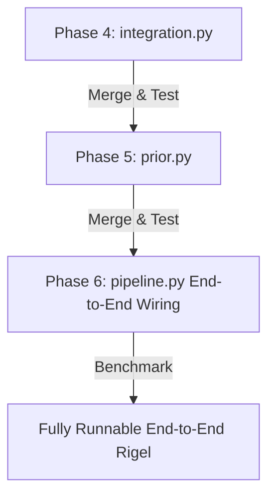

To escape our current "moat" and transition from disjoint, non-runnable code to a fully operational, end-to-end tool ready for benchmarking, we need a precise, logically tight **Integration and Fusion Guide**.

Looking at the codebase, the raw material is phenomenal: Phase 3 of the Density Model (v4) and Phase 3 of the Strand Model (v5) are both complete. They compile, run, and are tested. What remains is **Phase 4 (Probabilistic Fusion)**, **Phase 5 (MultiLocus Footer-Aware Prior Allocation)**, and **Phase 6 (Pipeline/EM Integration)**.

Below is the architectural blueprint to wire them together.

---

## 1. Unified Mathematical Engine of fusion (`integration.py`)

Density represents a continuous, regional opportunity-driven baseline prediction. Strand represents localized bin-by-bin alignment-pure likelihood information. We integrate them under a single unified objective function.

For each fine region $r$, let:
* $N_r = \text{compatible observed unspliced total } (C_r + B_r)$
* $K_r = \text{observed sense-like count after transcript-relative folding}$
* $D_r = \text{latent local gDNA count} \in [0, N_r]$
* $p_{dens}(d) = \text{NB}(d; r = \alpha_{post}, p = p_{nb})$ from `DensityEvidence`
* $L_{strand}(K_r \mid D_r = d, N_r) = \text{BetaBinomial}(K_r; \text{samples}=N_r - d, p_r, \kappa_d)$ combined with standard BetaBinomial gDNA.

We combine these into the fused log-posterior surface over the discrete bounded domain $d \in [0, N_r]$:
$$
\ell(d) = \log P_{dens}(D_r = d) + \log L_{strand}(K_r \mid D_r = d, N_r)
$$

### The Deconvolution/Fusion Engine
To handle all 4 RNA-seq regimes elegantly without magic numbers:

*   **Regime 1 & 2 (Unstranded, +/- Capture):** The library-wide `p_r1_sense` sits close to $0.5$. The strand likelihood $L_{strand}$ naturally collapses to a flat uniform constraint. The posterior is entirely driven by $\log P_{dens}(d)$, pulling information from regional boundary flux ($N_b$) or falling back to the robust Gamma-MoM background.
*   **Regime 3 & 4 (Strand-Specific, +/- Capture):** Strong strand specificity increases the curvature of $L_{strand}$ which pulls the mode $d^*$ in the direction of the sense/antisense split. Density acts as a shrinkage prior, preventing sparse regions from over-reacting to stochastic strand flips.

### Exact vs Laplace Approximation
*   **Exact Fusion ($N_r \le 50$):** Exactly evaluate $P_{fused}(d) \propto \exp(\ell(d))$ for $d \in \{0, \dots, N_r\}$. Directly compute the expectation $\mathbb{E}[D_r]$, the variance, and the exact $1 - \alpha$ confidence upper quantile $D_r^{upper}$.
*   **Bounded Laplace Fusion ($N_r > 50$):**
    1. Find $d^* = \text{argmax } \ell(d)$ in $[0, N_r]$ via a simple vectorised golden-section or Newton-Raphson line search on $[0, N_r]$.
    2. Compute the second derivative (Hessian) at $H = -\ell''(d^*)$.
    3. The posterior is standard Normal: $\mathcal{N}(d^*, \sigma^2 = 1/H)$ truncated to $[0, N_r]$.
    4. Compute truncated moments (mean, variance, upper confidence quantile) directly in closed form to avoid numerical integration.

---

## 2. Footprint-Aware Prior Table Allocation (`prior.py`)

A dangerous failure mode in RNA-Seq prior modeling is **hotspot smearing**: if an entire fine region has an off-target median density, but contains a localized 10,000-count capture hotspot, allocating that count across overlapping loci based on pure base-pair fractions will inflate the priors of neighboring transcripts that do not physically overlap the hotspot.

To solve this, we implement **Footprint-Aware Allocation**:

```
                  Fine Region (e.g. 1000bp)
[----------------------------=======================----------------------]
                             10,000-count Hotspot

           Locus A footprint                           Locus B footprint
    [-----------------------------]             [-----------------------------]
      allocated: ~0 counts (cold)                     allocated: ~10k counts
```

### The Mechanism
1. The prior assembler receives a `MultiLocus` object (which exposes concrete, sorted, non-overlapping `Locus` interval footprints).
2. We intersect these footprints against the actual Ambiguous EM Units (`ScoredFragments` CSR array) using native intervals. This maps each fragment's origin to the sub-interval.
3.
    *   **Observed gDNA Count Fraction ($D_{\text{EM}}^r$):** Projected proportionally onto overlapping loci using the fragment-level geometry (the C++ scan coordinates).
    *   **gDNA Effective Length ($L_{\text{EM}}^l$):**
        $$ L_{gDNA}^l = \sum_{r \in \text{footprint}} A_r \cdot L_{\text{eff}, r}^{raw} $$
        where $A_r = \rho_{post, r} / \rho_{\text{ref}}$ is the continuous relative exposure scalar.

---

## 3. End-to-End Pipeline Integration (pipeline.py)

With `integration.py` and `prior.py` in place, we remove the final barrier in `quant_from_buffer` to make the tool fully runnable.

```python
## In src/rigel/pipeline.py
def quant_from_buffer(
    buffer: FragmentBuffer,
    index: TranscriptIndex,
    strand_models: StrandModels,
    frag_length_models: FragmentLengthModels,
    stats: PipelineStats,
    calibration: "CalibrationResult",
    calibration_payload: "CalibrationScanPayload",
    *,
    em_config: EMConfig | None = None,
    scoring: FragmentScoringConfig | None = None,
    log_every: int = 1_000_000,
    annotations: "AnnotationTable | None" = None,
    emit_locus_stats: bool = False,
) -> tuple[AbundanceEstimator, "CalibrationResult"]:
    
    # 1. Score fragments in C++ to build ScoredFragments routing structures.
    scoring_cfg = scoring or FragmentScoringConfig()
    em_data = _score_fragments(
        buffer, index, strand_models, 
        calibration.fl_models.rna, calibration.fl_models.gdna,
        stats, estimator, scoring_cfg, log_every, annotations
    )
    
    # 2. Build multi-loci components.
    multi_loci = build_multi_loci(em_data, index)
    _assign_locus_ids(estimator, multi_loci)
    
    # 3. Fuse Density & Strand surfaces (Phase 4 integration).
    fused_evidence = fuse_density_and_strand(
        calibration.density_evidence, 
        calibration.region_gdna, # raw strand estimates
        calibration.calibration_context
    )
    
    # 4. Compile Footprint-Aware PriorTable (Phase 5 priors).
    prior_table = assemble_priors(
        multi_loci, fused_evidence, em_data, index
    )
    
    # 5. Partition & Run Parallel EM (Phase 6 wiring).
    partitions = pr.build_partitions(em_data, multi_loci, estimator)
    _run_locus_em_partitioned(
        estimator, partitions, multi_loci, index,
        gdna_prior_count_em=prior_table.gdna_prior_count,
        gdna_eff_len=prior_table.gdna_eff_len,
        enable_gdna=prior_table.enable_gdna,
        em_config=em_config or EMConfig(),
        annotations=annotations,
        emit_locus_stats=emit_locus_stats
    )
    
    # Attach priors back to the result for reporting.
    calibration = _replace(calibration, prior_table=prior_table)
    
    return estimator, calibration
```

---

## 4. Phased Implementation Playbook

We can safely and systematically land this integration in three sequential Pull Requests to avoid breaking master:



### PR 1: Fusion (`calibration/integration.py`)
*   Implement `FusedRegionGdnaEvidence` schema mirroring `calibration_roadmap_v3.md §5.5`.
*   Implement exact discrete deconvolution for $N_r \le 50$.
*   Implement truncated-normal Laplace optimizer for $N_r > 50$.
*   **Validation:** Write `tests/test_integration.py` verifying that unstranded datasets shrink completely to the density prior, while strand-specific datasets confidently shift towards the sense/antisense counts.

### PR 2: Allocation (`calibration/prior.py`)
*   Implement `PriorTable` and geometric allocation.
*   Filter out ineligible/untrustworthy regions using the `FLAG_INELIGIBLE` and `FLAG_NEAR_UNSTRANDED` flag masks.
*   **Validation:** Write `tests/test_prior.py` with mock loci and a massive hotspot,- verifying that none of the hotspot prior leaks into neighboring non-overlapping locus footprints.

### PR 3: Conduit Wiring (pipeline.py)
*   Remove the `NotImplementedError` inside `quant_from_buffer` and stitch the components together.
*   Re-run all synthetic scenarios under scenarios_aligned to update golden tests.
*   **Validation:** `pytest tests/ -v` clean run, outputting complete `quant.feather` and `gene_quant.feather` tables!

This layout gets us completely out of the "moat". We can launch Phase 4 immediately. Are there any parts of the discrete fusion likelihood or Newton-Raphson approximation you'd like to refine further before code-wise first?