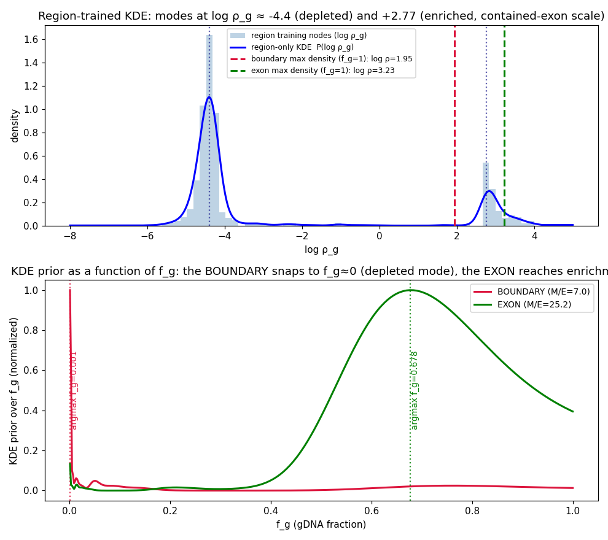
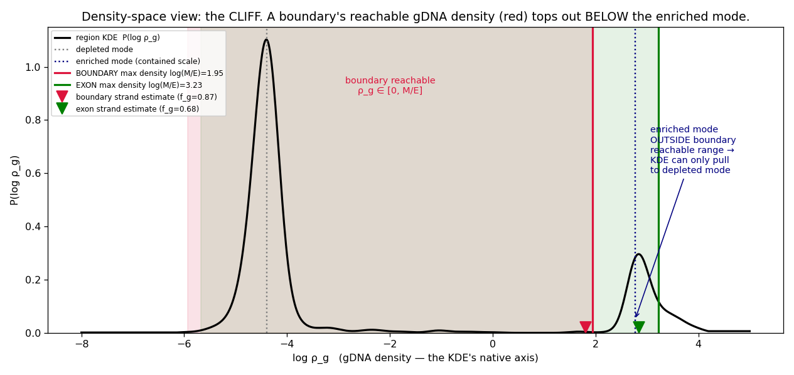
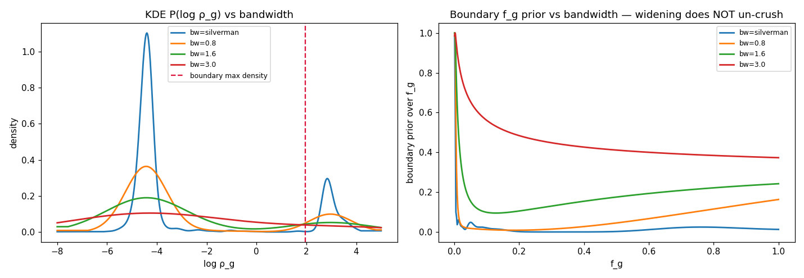
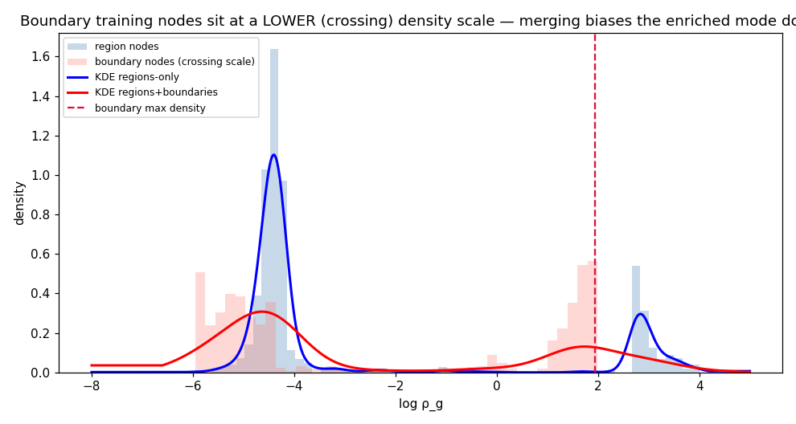

# KDE gDNA-Prior Review — Why Boundaries Leak, and How to Fix It Honestly

> **⚠️ SUPERSEDED (§10 proximity-weighted prior).** The proximity-weighted density prior proposed here
> (§10) was implemented and then found to **self-pin** (it conditions on the node's own datum `x_obs` and,
> on a high-count node, applies it back with exploding precision). The shipped fix is the **generative
> two-density prior** — `L_strand · P_KDE(real tails) · 1/(1−f_g)` — see
> `ambig_boundary_spliced_deconvolution.md` (RESOLUTION banner). This review's *diagnosis* (why the raw
> grid-multiply crushes boundaries; the depleted-mode-height problem) remains valid; only its §10 remedy
> is replaced.

**Status:** design review. **Scope:** the Phase-2 KDE gDNA-density prior (`gdna_density_prior.py`,
`bp_solver._kde_logprior`) and how it assigns a gDNA prior to **boundary** nodes.
**Target scenario:** capture-ON / strand-specific (ss0.99) / gDNA-300 / no-nascent — the case where the
calibration deconvolves only **2.87M** of the **3.00M** true gDNA fragments (a ~128k under-recovery).
Figures: `figures/kde_review/`.

---

## 0. Executive summary

The gDNA prior is short by **~128k fragments** *at the calibration level, before prior assembly runs*. It is
**not** multimappers (zero in this data), **not** intergenic gDNA (only 42k, correctly excluded), **not** the
prior-assembly/locus layer, and **not** the EM effective length. It is **mis-deconvolution**: the calibration
calls genuine gDNA as RNA. It splits **41,660** at contained exon/intron regions and **86,296** at **exon↔intron
boundary nodes**.

The boundary loss has a single, sharp cause (Figure 1): the **region-trained KDE crushes pure-gDNA boundaries to
`f_g ≈ 0.002`**. A boundary's crossing-fragment density tops out below the KDE's enriched mode, so the KDE can
only pull it toward the *depleted* mode. Because the KDE is the **only uncapped prior**, it overrides the
boundary's own (correct) strand evidence (`f_g ≈ 0.87`).

Two independent fixes are required, in priority order:

1. **Accuracy (Direction A).** Boundaries live at a *lower (crossing) density scale* than contained exons under
   capture. A single region-trained KDE has its enriched mode at the *contained* scale, unreachable by a
   boundary. Give boundaries an enriched reference at their own scale — via **separate region/boundary KDEs** or
   a **crossing→contained density rescale**.
2. **Honest precision (Direction B).** The KDE is currently applied as a sharp log-density with unit weight, so
   it can overrule a well-measured strand. Replace the ad-hoc cap with a **derived** per-node precision:
   *convolve the population KDE with each node's own density-estimate uncertainty*
   `σ_node = sqrt(Var(log f_g) + 1/(count+1))` — which already encodes count, length, and biological dispersion.
   A low-count/short node gets a smeared (weak) prior; a well-measured node gets the sharp KDE; neither
   overrules a confident strand.

Prior evidence that these are the real levers: forcing `gdna_eff_len ×0.5` lands the EM output on the oracle —
but that is a **compensating hack** for the 128k the deconvolution never recovered, not a fix. Fixing the KDE so
the deconvolution recovers the full genic gDNA removes the need for it.

---

## 1. What the KDE is for

The KDE's job is to **resolve AMBIG nodes** — nodes with transcription on *both* strands, where the strand
likelihood is degenerate with gDNA (a balanced ± count is equally "balanced ±RNA" or "unstranded gDNA"). Both
**regions** and **boundaries** can be AMBIG, so the KDE must serve both node geometries.

The KDE is **not required** for single-strand (unambiguous) nodes — the strand deconvolution resolves those on
its own. But a *correctly fit* KDE should only ever *improve* a single-strand node, so the ideal is **one
accurate prior applied to all nodes**. The current KDE fails this ideal for boundaries: instead of improving
them, it destroys a correct strand solve.

---

## 2. Where the gDNA goes (the mass audit)

```
oracle total gDNA:                     3,000,000
  ├─ pure intergenic (no locus):          42,448   ✓ correctly excluded
  └─ genic (should reach the prior):   2,957,552
calibration DECONVOLVES:               2,872,045   ← 127,955 SHORT, here, upstream of prior assembly
     gDNA mis-called as RNA:
       ├─ contained exon/intron:          41,660
       └─ exon↔intron boundaries:         86,296   ← the dominant loss, at first-class boundary nodes
gDNA prior sum (after far-left fix):   2,829,457   ← faithfully reflects the deconvolution (assembly OK)
```

- **Multimappers:** zero (all `NH=1`) — not the cause.
- **Boundary types (oracle crossing fragments):** intergenic↔genic outer boundaries are **pure gDNA (1.000)** and
  are locked correctly (G1 sinks, no strand continuity). The leak is entirely at **exon↔intron** boundaries,
  where the node is strand-continuous and *solves* gDNA-vs-RNA.

The prior/eff-length layer is essentially correct once the deconvolution is right. **The bug is in the
deconvolution of boundary nodes, and specifically in how the KDE prior scores them.**

---

## 3. The bug: boundaries snap to the depleted mode

> **Correction (see §10).** The "reachable-window / cliff" framing below (and the fig-1 bottom panel) was an
> early, partly-wrong reading. The KDE-prior argmax is in fact the **depleted mode for *every* node** — the
> depleted peak is ~4× taller (height 1.10 vs 0.28), so maximizing the density always slides to it; the fig-1
> "exon reaches enrichment" was a plot-range artifact. The real defect is that we **apply the KDE as a
> density-height term and let the solve slide `ρ_g` to the population's tallest peak**, instead of asking
> *which population this node belongs to* by **proximity**. §10 is the corrected model and the fix. This section
> is kept for the mechanism intuition; read §10 for the accurate account.



**Figure 1 (top):** the region-trained KDE `P(log ρ_g)` is bimodal — a large **depleted** mode at
`log ρ_g ≈ −4.4` (introns/intergenic, off-probe) and a smaller **enriched** mode at `log ρ_g ≈ +2.77`
(`ρ_g ≈ 16`, the *contained-exon* gDNA density under full-probe capture). The dashed lines mark each node's
*maximum attainable* density (its density at `f_g = 1`, i.e. `log(M/E)`):

- **Exon region:** `M/E = 25.2` → `log ρ = 3.23`, **past** the enriched peak.
- **Boundary:** `M/E = 7.0` → `log ρ = 1.95`, on the **left shoulder** of the enriched mode, **below its peak**.

**Figure 1 (bottom):** the KDE prior as a function of `f_g` (evaluated along `ρ_g = f_g·M/E`). The **exon** peaks
at `f_g ≈ 0.68` (it reaches the enriched mode at `f_g = 16/25 = 0.64`). The **boundary spikes at `f_g ≈ 0.001`** —
it is crushed to zero gDNA.

### Why *down*, not *up* (your question)

The boundary's `f_g=1` density (`log ρ = 1.95`) is in fact **closer in log-distance** to the enriched mode
(2.77, Δ=0.82) than to the depleted mode (−4.4, Δ=6.35). Intuition says "snap up." It snaps down anyway, for two
compounding reasons:

1. **The enriched *peak* is unreachable.** Reaching `log ρ = 2.77` needs `f_g = e^{2.77}/(M/E) = 16/7 = 2.35 > 1`
   — impossible. The boundary can only touch the enriched mode's **lower shoulder** (at `f_g = 1`), never its
   peak.
2. **The KDE cares about density *height*, not distance.** The argmax picks the highest `P(log ρ_g)` along the
   reachable path `f_g ∈ (0,1]`. The **depleted peak** (a full mode) is taller than the **enriched shoulder**
   (the flank of a mode the node can't climb). So the argmax lands on the depleted peak.

### Is it a cliff? (your question)

The marginalization itself is smooth — `_kde_logprior` evaluates `logpdf(log f_g + log(M/E))` continuously; it
does **not** snap-to-nearest-mode. But the **`M/E → argmax-f_g` mapping is effectively discontinuous**: as a
node's `M/E` crosses the enriched mode (`≈16`), the winning peak flips from *enriched* (M/E > 16, exons) to
*depleted* (M/E < 16, boundaries). So there is a hidden cliff in node-density space at `M/E ≈ mode`, and every
boundary sits on the wrong side of it. That is the brittleness you sensed.

### The correct view is density space (not fraction) — and it explains the cliff



The KDE's native axis is **`log ρ_g` (density)** — it is fit on `log ρ_g` and `_kde_logprior` queries it on
`log ρ_g = log f_g + log(M/E)`. Figure 1's bottom panel rendered that same prior against a *linear f_g* axis,
which compresses the entire low-density half of the KDE into `f_g ∈ [0, 0.002]` (the depleted mode at
`ρ_g = 0.012` maps to `f_g = 0.012/(M/E) ≈ 0.0017`) — that compression, plus the change-of-variables factor
`d log ρ_g/d f_g = 1/f_g → ∞`, is the "spike near zero" and the "undulations." Those are **plotting artifacts of
the fraction axis, not the prior.** Figure 4 shows the prior correctly, on `log ρ_g`, where it is a clean
bimodal density.

**The cliff, in density space.** A node's gDNA density is *bounded* — `ρ_g ∈ [0, M/E]`, because gDNA cannot
exceed the total unspliced mass. So each node has a **reachable density window** `(−∞, log(M/E)]`:

- **Exon** `M/E = 25` → window top `log ρ_g = 3.23` **contains** the enriched mode (2.77) → can sit on the peak.
- **Boundary** `M/E = 7` → window top `log ρ_g = 1.95` is **below** the enriched mode → the enriched peak is
  entirely **outside** the reachable window; only its lower shoulder is in range.

Within the boundary's window the tallest KDE feature is the **depleted peak** (a full mode), so the argmax lands
there → `f_g ≈ 0`. It is a genuine **cliff** because the KDE is *bimodal*: as `M/E` sweeps up through the
enriched mode, the reachable window abruptly begins to include the enriched peak and the argmax **jumps** from
depleted to enriched. Marginalization is smooth; the *density ceiling crossing a separated mode* is the
discontinuity. (The boundary's own strand estimate sits at its ceiling, on the near-zero enriched shoulder, so
the uncapped depleted peak overrides it.)

**Consequence:** the enriched reference for a node **must live inside that node's reachable density window**. The
contained-scale region KDE (enriched mode 2.77) violates this for *every* boundary (window top ≈ 1.95). A
boundary-trained KDE puts its enriched mode at the **crossing scale (≈1.5)**, which *is* inside the window — so
Direction A (separate KDEs, §5) is not merely one option, it is what the density geometry demands. And the
reference measure the solver adds is still fraction-space (`log f_g + log(1−f_g)`); the clean formulation makes
the entire prior side density-native (reference uniform in `log ρ_g`, KDE as the density prior, honest precision
per §6), emitting `f_g = ρ_g·E/M` only at the end for the EM.

### Bandwidth does not fix it



Widening the bandwidth (Figure 2) only **flattens** the KDE toward uninformative (left) — it does not move the
enriched mode down to the boundary scale. The boundary's `f_g` prior (right) goes flat but never develops an
*upward* pull; and the total deconvolved gDNA gets **worse**, because blurring the enriched mode weakens the
(correct) pull on contained exons:

| bandwidth | total deconvolved gDNA (oracle genic = 2,957,552) |
|---|---:|
| silverman (default) | 2,871,905 |
| 0.8 | 2,878,988 |
| 1.2 | 2,838,982 |
| 2.0 | 2,787,422 |
| 3.0 | 2,751,818 |

This confirms the problem is a **hard scale mismatch**, not valley depth. No smoothing of a contained-scale KDE
can classify a crossing-scale node.

---

## 4. Root cause: crossing scale ≠ contained scale under capture

The node model is built so that, **under a uniform (unenriched) library**, a boundary's crossing density equals
a region's contained density equals the true `ρ` (the "factor-1-under-uniform" invariant). Under **capture**
that invariant breaks by design: a contained-exon fragment sits fully on-probe, but a boundary-crossing fragment
only *partially* overlaps the probe (it straddles the intron edge), so it is captured less efficiently. The
boundary's gDNA density is therefore **genuinely lower** than the contained-exon's — this is a real, physical
capture bias, not an artifact.



**Figure 3** shows it directly: boundary training nodes form their **own enriched cluster at `log ρ_g ≈ 1.5`**,
distinct from and below the region enriched cluster at `2.77`. A region-only KDE (blue) never has a mode there,
so boundaries fall in its valley. Merging boundaries into a single KDE (red) drags the enriched mode down to
~1.9 **and** flattens it — which is exactly why boundaries were removed from training originally: **they bias the
region mode downward.** But removing them leaves boundaries with no enriched reference at all.

This is the crux: **boundaries and regions occupy two different enriched density scales under capture, and a
single mode cannot serve both.**

---

## 5. Direction A — make the KDE *accurate* for both geometries

Two viable options; both should be prototyped against Figures 1/3.

### A1. Separate region and boundary KDEs
Fit one KDE on region nodes (enriched mode ≈ 2.77) and one on boundary nodes (enriched mode ≈ 1.5); score each
node against its own-geometry fit. This is the cleanest — each geometry's enriched mode is where its nodes
actually are, so boundaries can *reach* enrichment. It was tried before and reverted because it (i) fragmented
the training set (fewer nodes per fit → weaker in the fully-unstranded case where the KDE is the only signal),
and (ii) regressed some conditions. Given this diagnosis, it is worth revisiting **with the fragmentation
addressed**: pool enough boundary training nodes, and/or share the *depleted* mode across geometries (only the
*enriched* mode is geometry-specific), so the boundary KDE borrows strength from the (large, shared) depleted
population and only fits its own enriched mode.

### A2. Rescale the crossing density to a contained-equivalent
Keep **one** region-trained KDE (full training set, no fragmentation) but, before scoring a boundary, multiply
its density by the **capture crossing→contained ratio** `r = exp(mode_region − mode_boundary)` (≈ `e^{2.77−1.5}`
from Figure 3) so the boundary lands on the region enriched mode when it is genuinely enriched. `r` is estimable
from the two enriched clusters (or from the ratio of contained-exon to boundary-crossing density on
gDNA-clean/single-strand nodes). This preserves the region mode's accuracy and gives boundaries the correct
upward pull with no training-set fragmentation. The risk is estimating `r` robustly when capture is weak (as
capture → off, `r → 1` and the rescale must vanish — a natural boundary condition to test with the capture knob,
§7).

**Recommendation:** prototype **A2** first (one KDE, minimal moving parts, `r→1` degrades gracefully to
capture-off); fall back to **A1** if a single shared shape proves too coarse.

---

## 6. Direction B — honest precision for the KDE prior

Even with the correct mode, the KDE is applied **too strongly**: `_kde_logprior` adds the full `log P̂(log ρ_g)`
at unit weight, and it is the *only uncapped* prior term (the weak global floor is capped at one
pseudo-observation). A sharp KDE mode therefore acts like a high-precision likelihood and can overrule a node's
own strand evidence — which is what crushes the strand-confident boundary from 0.87 to 0.002. A flat "cap" is a
band-aid; here is the principled replacement.

### The honest-precision principle
A node's density estimate `log ρ̂_g` is itself uncertain, and we already quantify that uncertainty — it is the
per-node log-density noise the substrate computes for the bandwidth floor:

```
σ_node = sqrt( Var(log f_g)  +  1/(gcount + 1) )
             └ belief/dispersion ┘   └ discrete-count (Fisher) + length via E ┘
```

This single scalar already honors all three honest-precision inputs:
- **discrete counts** — `1/(gcount+1)` blows up for low-count nodes;
- **length** — `gcount` enters through the effective length `E` (a short node accumulates little mass →
  low `gcount`);
- **biological dispersion** — `Var(log f_g)`, the solve's posterior spread.

### The derivation
The KDE `P̂(log ρ_g)` is a **population prior**. For a specific node we do not know its density exactly; we know
it to within `σ_node`. The honest prior over the node's `f_g` is therefore the population KDE **convolved with the
node's own uncertainty**:

```
P_node(f_g)  ∝  ∫ P̂(u) · N(u ; log ρ_g(f_g), σ_node²) du
```

Because a Gaussian-kernel KDE convolved with a Gaussian is just a **wider-bandwidth KDE**, this has a closed
form — evaluate the *same* fitted KDE with a **per-node effective bandwidth**:

```
h_node = sqrt( h_pop²  +  σ_node² )
```

**Properties (all desirable, all derived — no tunable cap):**
- A **low-count / short / high-dispersion** node → large `σ_node` → wide `h_node` → the KDE prior is **smeared and
  weak**, so it cannot overrule anything. (This is exactly the "low counts are imprecise" honest-precision rule,
  applied to the prior.)
- A **well-measured** node → small `σ_node` → `h_node ≈ h_pop` → it gets the full sharp KDE.
- A node whose **strand likelihood is confident** (high count → high Fisher precision `N(2κ−1)²`) is not
  overruled, because the smeared prior's precision is bounded by the population dispersion, while the strand's
  precision grows with its count.
- It **degrades gracefully**: as evidence vanishes, the prior widens toward the population marginal rather than
  snapping to a mode.

This replaces "the KDE is uncapped and too strong" with a first-principles, per-node precision that mirrors the
honest-precision treatment already used for strand and message terms. It also *softens* the boundary crush on its
own (imprecise boundaries stop being pinned), though it does **not** replace Direction A — a well-measured
boundary at the wrong mode would still be confidently wrong. **A and B are complementary and both needed.**

---

## 7. Validation plan — the capture knob

The simulator exposes hybrid-capture as a continuous **binding-energy knob** (no capture → infinite/perfect
enrichment). This is the right instrument to validate the fix, because the crossing-vs-contained scale gap is a
*function of capture strength*:

- **Sweep** binding energy from off → strong and, at each level, plot the fitted enriched mode(s) and the effective
  lengths for **gDNA, nascent RNA, and mature RNA** (all three should follow the same node-extraction + IPR
  paradigm).
- **Capture-off boundary condition:** crossing density = contained density (`r → 1`); the region and boundary
  enriched modes must **coincide**, and any A2 rescale must vanish. If they don't, the node model's
  factor-1-under-uniform invariant is itself broken.
- **Increasing capture:** the boundary enriched mode should separate *downward* from the contained mode by the
  measured `r`; the fix should keep the total deconvolved gDNA on the oracle (2.96M genic) across the whole sweep.
- **Metric:** total deconvolved gDNA vs oracle genic, plus the per-boundary `f_g` vs oracle at the exon↔intron
  nodes (the crushed population in §3). Success = the 86k boundary loss closes **without** the `gdna_eff_len ×0.5`
  compensation, and the contained-exon accuracy is preserved.

---

## 8. Also on the table (lower priority)

- **SPLICED_IMPLICIT routing.** Mate-pairs that flank an intron with no CIGAR-`N` are "implicitly" spliced
  (mature). If any are being counted as *unspliced* boundary crossings, they inject real mature RNA into the
  boundary's unspliced pool and the strand solve correctly calls it RNA — a second, smaller channel of boundary
  gDNA loss. Toggling the mature-absorption message terms moved the total by only ±4k, so this is a minor
  contributor at most, but worth confirming once the KDE fix is in.
- **Retire the compensating eff-length hack.** `gdna_eff_len` should not need a ×0.5 fudge once the prior recovers
  the full genic gDNA; re-audit the IPR eff-length after the KDE fix and remove any implicit compensation.

---

## 9. Proposed sequence

1. **B (honest precision)** — per-node `h_node = sqrt(h_pop² + σ_node²)`. Low-risk, principled, and immediately
   stops the KDE from overruling confident strand nodes. Ship + measure.
2. **A2 (crossing→contained rescale)** — restores the *upward* enrichment pull for genuinely-enriched boundaries.
   Validate `r → 1` at capture-off with the knob (§7).
3. If a single shared shape is too coarse, **A1 (separate KDEs)** with a shared depleted mode.
4. **Capture-knob sweep** as the standing regression for gDNA / nascent / mature effective lengths and the
   deconvolved-gDNA-vs-oracle invariant.

Success criterion: calibration deconvolves ~2.96M genic gDNA (not 2.87M), the per-locus gDNA prior needs no
eff-length compensation, and the capture-ON/ss0.99 end-to-end leak closes at its source.

---

## 10. The proximity-weighted density prior — derivation and plan

This section supersedes the "reachable-window/cliff" intuition of §3 with the correct model, settled with the
design owner. **Everything is in density/count space; `f_g` never appears** — the EM consumes a gDNA *count*
plus an effective length, and `f_g` is a diagnostic ratio with no role in the solve, the prior, or the interface.

### 10.1 The KDE's role
The KDE estimates the **gDNA prior** for a node — *one input* to the per-node solver, which also uses transcript
structure, the strand likelihood (which has **priority**), and neighbour message-passing/imputation. It is **not**
the final gDNA estimate.

### 10.2 The node's observed density (circular, iterated)
The input is the node's **best prior-free solved gDNA log-density**:
```
x_obs = log ρ̂_g  =  log( ĝ / E_g )
```
where `ĝ` is the pass-1 gDNA count from the solver run with structure + strand + messages + the weak *capped*
floor, **without** the KDE. The KDE is then fit on the pass-1 densities of the training nodes; each node's
pass-1 density is mapped against it for pass-2 (and the loop may iterate). This is deliberately circular — it is
the best available signal. It is emphatically **not** the total density `M/E`, which includes RNA and would be
catastrophic (an RNA-rich exon would masquerade as enriched gDNA).

### 10.3 The mapping (proximity-weighted posterior)
The population prior is the KDE, a unit-weight Gaussian-kernel density over training log-densities `xᵢ`,
bandwidth `h`:
```
P(x) = (1/N) Σᵢ φ(x ; xᵢ, h)
```
Treat the node's `x_obs` as a noisy observation of its true log-density with honest-precision width `σ` (§10.4),
and form the proximity-weighted posterior — "integrate the node against the KDE, weighting each point by its
proximity to `x_obs`":
```
q(x) ∝ P(x) · φ(x ; x_obs, σ)
```
Because a product of Gaussians is a scaled Gaussian, with `s² = h² + σ²`:
```
φ(x; xᵢ, h)·φ(x; x_obs, σ) = Zᵢ · φ(x; μᵢ, τ)
   1/τ² = 1/h² + 1/σ²          μᵢ = τ²(xᵢ/h² + x_obs/σ²)
   Zᵢ   = φ(x_obs ; xᵢ, s)     ← proximity weight of training node i
```
so the gDNA-prior log-density is a **proximity-weighted average of the training nodes**:
```
x*    = Σᵢ Zᵢ μᵢ / Σᵢ Zᵢ
Var*  = Σᵢ Zᵢ (τ² + μᵢ²) / Σᵢ Zᵢ  −  x*²        (prior spread → honest confidence)
```
`Zᵢ` decays as a Gaussian in `|x_obs − xᵢ|`: training nodes **far** from `x_obs` contribute ~nothing; the
**nearest population dominates**. This asks "which population is this node drawn from?" (membership) rather than
"where is the population densest?" (frequency) — the latter is the current bug, which always answers "the
depleted majority."

### 10.4 Honest precision (Direction B, derived not capped)
The proximity width is the node's own density-estimate noise:
```
σ = σ_node = sqrt( Var(log ρ_g)  +  1/(gcount + 1) )
```
which already honors **counts** (`1/(gcount+1)`, Fisher), **length** (`gcount` scales with `E`), and
**biological dispersion** (`Var(log ρ_g)` from the solve). Hence the proximity scale is `s = √(h² + σ_node²)`:
a precise node uses a tight window (trusts its own density); an imprecise/AMBIG node uses a wide window (leans on
the population). The strand keeps priority because its count-based Fisher precision competes against `Var*`; a
confident strand is not overruled.

### 10.5 Why it fixes the boundary crush
A partially-enriched boundary has `x_obs ≈ log 6 ≈ 1.8`. The **enriched** training cluster (`xᵢ ≈ 1.5–2.8`) is
0–1 units away → large `Zᵢ`; the **depleted** cluster (`xᵢ ≈ −4.4`) is ~6 units away → `Zᵢ ≈ e^{−≈50} ≈ 0`. So
`x*` lands next to the enriched population — regardless of the depleted peak being 4× taller. No crush, and no
cliff (the map is smooth in `x_obs`).

### 10.6 Emitting the prior to the solver
The pass-2 per-node solve adds a single **Gaussian prior on `log ρ_g`** centred at `x*` with precision
`π* = 1/Var*` (bounded so the strand retains priority), replacing the raw `_kde_logprior` density term:
```
prior_term(ρ_g) = −½ · π* · (log ρ_g − x*)²
```
The gDNA prior **count** handed downstream is `exp(x*)·E_g`, physically capped at the node's total unspliced
mass `M` (a node can never be assigned more gDNA than it has — the only bound needed; it self-saturates at
"all unspliced mass is gDNA"). No fraction is formed anywhere.

### 10.7 Implementation plan
1. **Replace `_kde_logprior`** with `_kde_density_prior(x_obs, σ_node, kde) → (x*, Var*)` implementing §10.3
   (closed-form proximity-weighted mean/variance over the kernel centres — O(N_train) per node, vectorizable).
2. **Feed `x_obs` from pass 1.** The two-pass structure already exists (`calibrate._sweep(None)` then
   `_sweep(prior)`); pass the pass-1 belief's `log ρ_g` per node into pass 2 as `x_obs`. (Optionally iterate
   pass-2 → refit → pass-3; start with one extra pass.)
3. **`σ_node`** from the belief: `sqrt(Var(log ρ_g) + 1/(gcount+1))` (reuse the substrate's `log_rho_std`).
4. **Solver term:** add the Gaussian `−½ π* (log ρ_g − x*)²` on the solve grid; drop the bimodal density term.
   Bound `π*` so a confident strand wins (strand priority).
5. **Single KDE for now** (region-trained, applied to all nodes); separate region/boundary KDEs deferred
   (Direction A) — revisit once the mapping is validated.
6. **Purge fractions** from the prior/solve/interface reasoning; keep only counts and densities.

### 10.8 Validation
- **Unit:** a synthetic boundary at `x_obs=1.8` against a bimodal KDE returns `x*` at the enriched cluster, not
  the depleted mode; a true depleted node (`x_obs=−4.4`) stays depleted; monotone, no discontinuity in `x_obs`.
- **In-process:** total deconvolved gDNA → ~2.96M genic (from 2.87M); per-boundary `f_g`(diagnostic) at the
  exon↔intron nodes recovers from ~0.002 toward oracle; gDNA=0 stays safe.
- **End-to-end + capture knob:** the capture-ON/ss0.99 leak closes at its source with **no** `gdna_eff_len ×0.5`
  compensation; sweep binding energy and confirm graceful behaviour as capture → off.
